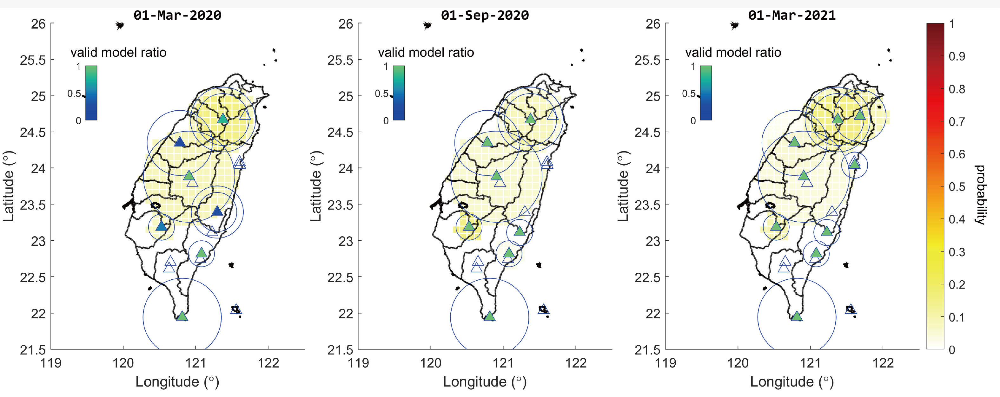
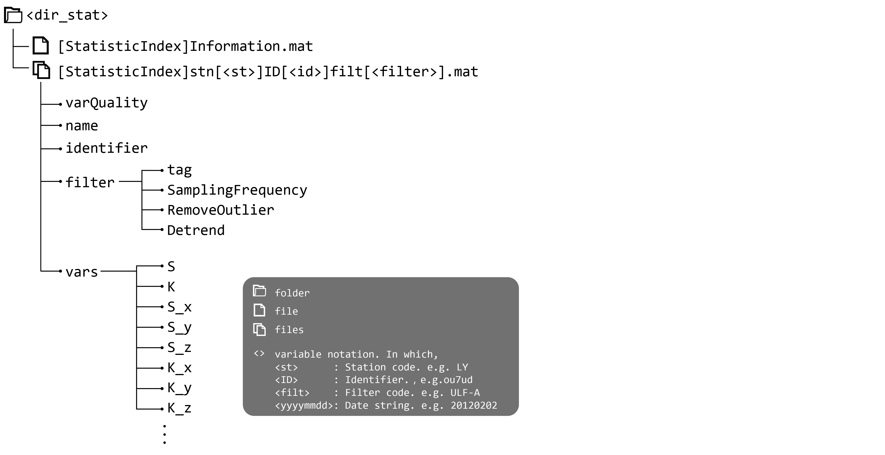
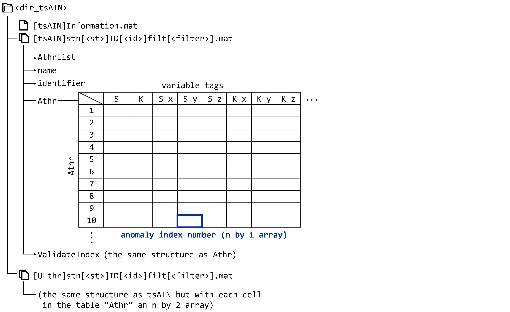
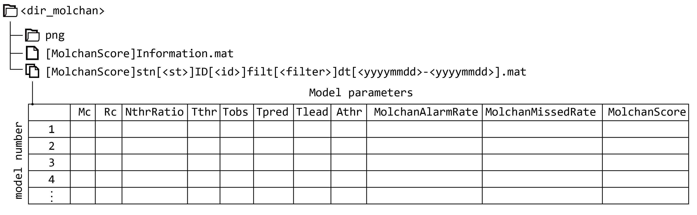
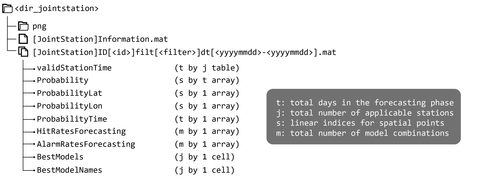

<!-- TODO: git commit and push unpredictable-life
FIXME: Delete the following in the future 

`cd` to the folder where there is `.jmd`, and 
```
lazyhugo();
cp2content("D:\\GoogleDrive\\Sites\\unpredictable-life\\content\\en\\my-project\\MagTIP")
``` -->


# HELLO

## Introduction

MagTIP calculates the TIP (Time of Increased Probability) of earthquakes basing on the geomagnetic records of Central Weather Bureau of Taiwan. 
The algorithm allows for the optimization of the model parameters, and gives the overall TIP (named joint-station TIP). 
The probability of capturing a target event in space and time can be derived based on the joint-station TIP, by considering the results from a large set of randomly permuted of model parameters simultaneously.

In the traditional TIP forecasting, the type and the number of input data have to be uniquely formatted otherwise re-training according to the new format is required. 
As a result, either the conversion for fitting new data to old format (where some information must lose), or an extra waiting period (e.g. 7 years) for re-training models with new data, is required. 
The time scale of the evolution of the underground dynamical system is generally thought to be large, hence data collected from old stations are precious. For being able to fully utilizing both the data from the most modern instruments and older sensors, the project of this year aims for the multivariate MagTIP forecasting system. 

The newest multivariate MagTIP forecasting system not only supports three-component and one-component geomagnetic signals simultaneously, but also allows additional earthquake-relevant time series to be involved in calculating TIP.

## Getting Started
The main functions of MagTIP take directories that contains necessary files as input arguments, and all output variables are saved in another directory as ".mat" files.
In this document, the input/output variable that contains the information of the path to a directory (i.e., a folder) is prefixed by `dir_`; for example, `dir_data` is the directory for the formatted geomagnetic data, and `dir_stat` is the directory for statistic indices. 
The `dir_`-prefixed variables are each a sequence of characters being something like `'D:\MagTIP-2021\output_var\StatisticIndex'`. 

#### The Sample Script for Everything
There is a script **"MagTIP_2021b.m"** contains the sample codes of the whole process; you can easily make everything set and go through the entire MagTIP procedures following the steps below:
- switch current directory to the folder named "MagTIP-2021"
- run section(s) in the script of "MagTIP_2021b.m"

In the beginning (the first three sections), you will see several pop-out windows for selecting the directory of geomagnetic data (`dir_data`) and loading the toolbox (`dir_toolbox`). 
Select the right folders as instructed, and they will be automatically added to path and be ready to use.

### Input/Output Directories
Assigning directories for input/output data or variables is necessary before running any application. 
For example:

```matlab
dir_catalog = 'data\spreadsheet'; 
        % directory of event catalog & station location
dir_data = 'data\geomag_1'; 
        % directory of geomagnetic timeseries
dir_stat = 'output_var\StatisticIndex'; 
        % directory of statistic indices
dir_tsAIN = 'output_var\tsAIN'; 
        % directory for storing anomaly index number (AIN)
dir_molchan = 'output_var\Molchan'; 
        % directory for storing Molchan scores
dir_jointstation = 'output_var\JointStation'; 
        % directory for the time series of EQK, TIP and probability
```

This can be done alternatively using `mkdir_default()` to create the set of empty folders with each folder name never repeats. 
That is, the code chunk above is equivalent to

```matlab
dir_catalog = 'data\spreadsheet'; 
dir_data = 'data\geomag_1';
[dir_stat, dir_tsAIN, dir_molchan, dir_jointstation] = mkdir_default('output_var')
```


Here is an overview of this default directory structure: 

<!-- `LaTeX Error: Cannot determine size of graphic in ../fig/dirtree.svg (no Bound ingBox).` when doctype is "md2pdf" -->

You can create this directory structure manually by adding new folders using your OS's interface. 
You can also assign the `dir_`-prefixed variables by using `dirselectassign(...)`, where windows pop out for selecting existing directory. 
For more information, see "MagTIP_2021b.m" and "dirselectassign.m".

**⚠Notice:** 

1. `dir_spreadsheet` must contain `catalog.csv` and `station_location.csv`, with the first row (column names) being 'code', 'format', 'Lon', 'Lat' for `station_location.csv`, and 'time', 'Lon', 'Lat', 'Depth', and 'Mag' for `catalog.csv`.
2. The order of column names can be arbitrarily arranged, but the strings have to be exactly the same as above.
3. Geomagnetic time series in `dir_data` should be converted to the standard format. For more information, see `convdata0`.

#### The Format of Station list and Earthquake Catalog

The `station_location.csv` specifies the location of every station;
here is an example for `station_location.csv`: 

| code | format | Lon      | Lat      |
| ---- | ------ | -------- | -------- |
| MS   | 馬仕   | 120.633  | 22.61089 |
| TW   | 灣丘   | 120.5286 | 23.18502 |
| ...  | ...    | ...      | ...      |
| XC   | 新城   | 121.6095 | 24.0383  |
| SM   | 日月潭 | 120.9076 | 23.881   |

The `catalog.csv` is the catalog covering at least the entire range of all training phases; 
here is an example for `catalog.csv`:

| time            | Lon    | Lat   | Depth  | Mag  |
| --------------- | ------ | ----- | ------ | ---- |
| 2020/8/10 06:41 | 121.59 | 23.81 | 29.86  | 3.41 |
| 2020/8/10 06:29 | 120.57 | 22.18 | 43.54  | 3.02 |
| 2020/8/10 06:14 | 121.7  | 22.17 | 124.78 | 4.13 |
| ...             | ...    | ...   | ...    | ...  |

### The Standard Data Format

All original files of geomagnetic timeseries have to be converted to the new format before any function that takes `dir_data` as an input argument.
You can convert the data by simply applying:

```matlab
convdata0(dir_originalfiles, dir_data)
```
In which, 
- `convdata0` takes two required input argument. The first is the directory of original files, and the second is the output folder for the new files.
- The naming of original files should be "yyyymmdd.StationCode" or "yyyymmddHH.StationCode". For example, "20150202.MS" and  "2015020223.MS", respectively.
- The naming criteria for new files is "stn[StationCode]dt[yyyymmdd]type[DataType].mat". For example, "stn[MS]dt[20150202]type[full].mat" is the formatted geomagnetic data converted from "20150202.MS", which is a one-component time series. 
- The process of conversion may take very long if the number of files to be converted is large. Use the option `'ContinueFromLast'` and `'FilterByDatetime'` to avoid repeatedly converting the files that have already been converted before.
- For more information, see "convdata0.m".


### The Main Process
After all data are prepared (those in `dir_data` and `dir_spreadsheet`), you can run the whole forecasting process simply with:
```matlab
statind(dir_data,dir_stat); 
anomalyind(dir_stat,dir_tsAIN); 
molscore(dir_tsAIN,dir_catalog,dir_molchan);
molscore3(dir_tsAIN,dir_molchan,dir_catalog,dir_jointstation);
```
In which, `statind` calculates specific statistical quantities of each day; `anomalyind` calculates anomaly index according to different $A_\text{thr}$ threshold; `molscore` gives optimized models; and `molscore3` use optimized models to calculate probability forecasts.

### Visualization of the Results
There are several tools provided for visualizing the result.

#### Probability Forecast
`plotProbability` visualizes the probability of the calculated results (which is stored in `dir_jointstation` in default), with options for whether to plot epicenters of target events (目標地震) and for specifying the date time to plot, as an example:

```matlab
dir_prob = fullfile(dir_jointstation,'png','prob');
dates2plot = [datetime(2020,3,1):calmonths(6):datetime(2021,3,1)];
plotProbability(dir_jointstation,dir_catalog,dir_prob,...
    'TimeRange',dates2plot,'PlotEpicenter','all');
```


> In this figure, the triangle denotes the location of station; circle(s) around each station denote the maximum and minimum range of detection ($R_C$) of the models that are responsible for calculating the TIPs; the filled color of the triangle denotes the ratio of valid models of the day; and hollow triangle denotes the station that cannot provide TIP for the day.


#### The Matching Diagram
`plotEQKTIP1` provides the 1-dimensional match diagram of a specific model.

```matlab
dir_png = fullfile(dir_molchan,'png','EQKTIP');
plotEQKTIP1(dir_tsAIN,dir_molchan,dir_catalog,dir_png,...
            'ForecastingPhase',calyears(1),'ShowTrainingPhase',1,'Rank',1,...
            'ForceMagnitude',-0.5,'scatter',1);
```


> In this figure, the match diagram of EQK and TIP defined by the model of first rank is demonstrated. The intervals of black color denotes the days where there is no data in $T_\text{obs}$ at all (i.e. this model is invalid at these time) and hence TIP cannot be calculated.


## Documentation
**⚠Warning:**
- Please don't assign undocumented name-value pair parameters to the functions. For example, `'CreateInfoOnly'` and `'InParforLoop'`, which are preserved for parallel computing, and you will never need to set them manually.

### Main Functions

There are roughly four stages in the MagTIP forecasting process: 

1. the calculation of statistical index
2. the calculation of anomaly index number according to 1.
3. the calculation of TIP and the Molchan score according to 2.
4. probability forecasts according to 2. and 3.

The four stages is wrapped by four functions with keyword options that we can customize the parameters related to model optimization and probability forecast. 
The four main functions are wrapper functions for routine training and forecasting process. As follow:


#### Data Preprocessing (`convdata0`)

<div class="markdown"><p>The original geomagnetic data  &#40;which are those in &quot;.csv&quot; format being something like &quot;2008010300.KM&quot; or &quot;20190307.LY&quot;&#41; should be converted to a standard format before any calculation.  <code>convdata0&#40;dir_originalfiles, dir_data&#41;</code> read original data in <code>dir_originalfiles</code> and save them in the standard format at the directory <code>dir_data</code>.</p>
<p><strong>Keyword Argument:</strong></p>
<ul>
<li><p>&#39;ContinueFromLast&#39;: Default is <code>false</code>. If <code>true</code>, it compares the names  of all old files in the <code>dir_originalfiles</code> and the new files in <code>dir_data</code> before conversion  to avoid files that are already being converted to be converted again.  This additional procedure may take several hours depending on the size of database;  a more efficient way for avoiding  repeated processing is to manually specify &#39;FilterByDatetime&#39;. See below.</p>
</li>
<li><p>&#39;FilterByDatetime&#39;: Only convert the files in the assigned time range&#40;s&#41;. It supports: </p>
<ul>
<li><p>A datetime. For example, when <code>&#39;FilterByDatetime&#39;, datetime&#40;2010,10,10&#41;</code>, only files  with time tag being or after 2010-Oct-10 will be converted.</p>
</li>
<li><p>N by 2 datetime array, for example, </p>
<pre><code>&#39;FilterByDatetime&#39;, &#91;datetime&#40;2009,12,10&#41;, datetime&#40;2010,10,10&#41;;...
                     datetime&#40;2013,12,10&#41;, datetime&#40;2017,10,10&#41;&#93;;</code></pre>
<p>, only the files in the two time ranges &#91;2009-Dec-10, 2010-Oct-10&#93; and &#91;2013-Dec-10, 2017-Oct-10&#93; will be converted; ohterwise, ignored.</p>
</li>
</ul>
</li>
</ul>
<p><strong>NOTICE:</strong></p>
<ul>
<li><p>Files in the original format must be uniquely named as &#39;20200101.HC&#39; or  &#39;2020010109.HC&#39; for example.</p>
</li>
<li><p>If not uniquely named, such as &#39;..\HC\20200101.txt&#39;, &#39;..\CS\20200101.txt&#39;,  the second one will be regarded as a duplicated file and be moved out to  an alternative folder &#40;<code>dir_alt</code>&#41;</p>
</li>
<li><p>every file should have its extension as the code of the corresponding station,  e.g. &#39;20200101.HC&#39; is correct; &#39;20200101.txt&#39; is not valid and an error will occur.</p>
</li>
</ul>
</div>


#### Statistical Index Calculation (`statind`)

<div class="markdown"><p><code>statind&#40;dir_data,dir_output&#41;</code> calculate daily statistics &#40;a statistical  quantity as an index of the day&#41; of the daily timeseries in <code>dir_data</code>.  The output variables are stored in <code>dir_output</code>.</p>
<p><strong>Example</strong>:</p>
<pre><code class="language-matlab">statind&#40;dir_data,dir_output,&#39;StatName&#39;,&#39;S&#39;,&#39;StatFunction&#39;,@skewness, &#39;Filter&#39;, &#123;&#39;ULF-A&#39;,&#39;ULF-B&#39;&#125;&#41;;</code></pre>
<p>In which, <code>dir_data</code> is the directory for the time series in the standard format; <code>dir_output</code> is the <code>dir_stat</code> mentioned before.</p>
<p><strong>Keyword options</strong>:</p>
<ul>
<li><p><code>&#39;StatName&#39;</code></p>
<ul>
<li><p>The abbreviations for the name of statistical indices.  They can be arbitrarily defined but have to be the same number of  elements as that of <code>&#39;StatFunction&#39;</code>.</p>
</li>
<li><p>Default is <code>&#123;&#39;S&#39;,&#39;K&#39;&#125;</code> &#40;for Skewness and Kurtosis&#41;.</p>
</li>
</ul>
</li>
<li><p><code>&#39;StatFunction&#39;</code></p>
<ul>
<li><p>The function handle for calculating statistical index.</p>
</li>
<li><p>It has to be of the same number of elements as that of <code>&#39;StatName&#39;</code></p>
</li>
<li><p>Default is <code>&#123;@skewness,@kurtosis&#125;</code> for calling the <code>skewness&#40;&#41;</code>  and <code>kurtosis&#40;&#41;</code> functions.</p>
</li>
</ul>
</li>
<li><p><code>&#39;Filter&#39;</code></p>
<ul>
<li><p>Apply filter&#40;s&#41; to time series loaded from <code>dir_data</code>. Generally  applying a filter very largely increase the computing time, so you  may consider <code>&#39;SaveFilteredData&#39;</code>.</p>
</li>
<li><p>Default is <code>&#123;&#39;no&#39;&#125;</code>, where no filter will be applied.</p>
</li>
<li><p>Supported arguments are <code>&#39;no&#39;</code>, <code>&#39;ULF-A&#39;</code> &#40;a band pass filter of  frequency range <code>&#91;0.001 0.003&#93;</code> Hz&#41;, <code>&#39;ULF-B&#39;</code> &#40;<code>&#91;0.001 0.01&#93;</code> Hz&#41;,  and <code>&#39;ULF-C&#39;</code> &#40;<code>&#91;0.001 0.1&#93;</code> Hz&#41;.</p>
</li>
<li><p>Also see <code>filterthedata&#40;&#41;</code>.</p>
</li>
<li><p>If multiple filters are applied, for example <code>&#123;&#39;no&#39;, &#39;ULF-A&#39;&#125;</code>, then  two sets of result according to no-filter data and ULF-A band passed data are going to be produced. </p>
</li>
</ul>
</li>
<li><p><code>&#39;SaveFilteredData&#39;</code></p>
<ul>
<li><p>Save the filtered data to an alternative folder. Their directory is parallel to that of no-filter data.</p>
</li>
</ul>
</li>
<li><p><code>&#39;FilterByDatetime&#39;</code></p>
<ul>
<li><p>It should be a two element datetime array.</p>
</li>
<li><p>If applied, all files with date time tag not in the range will be ignored.</p>
</li>
<li><p>Default is <code>&#91;datetime&#40;0001,1,1&#41;, datetime&#40;2999,12,31&#41;&#93;</code>, resulting  in no data selection by date time tag.</p>
</li>
</ul>
</li>
</ul>
</div>


- The output directory and data structure is:
  


#### Anomaly Index Number Calculation (`anomalyind`)

<div class="markdown"><p><code>anomalyind&#40;dir_stat,dir_output&#41;</code> calculates anomaly index number &#40;AIN&#41;  according to a list of &#36;A_\text&#123;thr&#125;&#36;; <code>dir_out</code> is where the output  variables stored. </p>
<p><strong>Example:</strong></p>
<pre><code>anomalyind&#40;dir_stat,dir_tsAIN&#41;;</code></pre>
<p><strong>Keyword options</strong>:</p>
<ul>
<li><p><code>&#39;AthrList&#39;</code>:</p>
<ul>
<li><p>the list of &#36;A_\text&#123;thr&#125;&#36; &#40;the multiplier of the median value  of the statistical indices within the moving time window&#41;</p>
</li>
<li><p>default is <code>&#91;1:10&#93;</code></p>
</li>
</ul>
</li>
<li><p><code>&#39;MovingWindow&#39;</code></p>
<ul>
<li><p>the moving-window length for calculating the median value mentioned  above</p>
</li>
<li><p>default is <code>1000</code> &#40;days&#41;</p>
</li>
</ul>
</li>
</ul>
<p><strong>Input and output:</strong></p>
<ul>
<li><p><code>anomalyind</code> takes the statistic index output from <code>statind</code> by loading them from <code>dir_stat</code>.</p>
</li>
<li><p>The calculated anomaly index is saved in <code>dir_tsAIN</code>.</p>
</li>
</ul>
</div>


- The output directory and data structure is:
  


#### TIP and Molchan Score Calculation (`molscore`)

<div class="markdown"><p><code>molscore&#40;dir_tsAIN,dir_catalog,dir_molchan&#41;</code> is responsible for single station&#39;s TIP &amp; Molchan score calculation. </p>
<p><strong>Example:</strong></p>
<pre><code>dir_catalog &#61; &#39;\MagTIP-2021\spreadsheet&#39;;
dir_tsAIN &#61; &#39;\MagTIP-2021\output_var\tsAIN-J13-TZ2&#39;;
dir_molchan &#61; &#39;\MagTIP-2021\output_var\MolchanScore-J13-TZ2&#39;;
molscore&#40;dir_tsAIN,dir_catalog,dir_molchan&#41;;</code></pre>
<p><strong>Keyword options</strong>:</p>
<ul>
<li><p>&#39;TrainingPhase&#39;</p>
<ul>
<li><p>Assigns a &#40;set of&#41; training phase&#40;s&#41;. It should be of type <code>&#39;calendarDuration&#39;</code>, <code>&#39;duration&#39;</code>, an N by 2 array of <code>&#39;datetime&#39;</code>,  or an N by 2 cell array, where N is the number of the training phases. If given an N by 2 array specifying N training phases, then N sets  of results will be produced separately, with output format being  <code>&#39;&#91;MolScore&#93;stn&#91;&#37;x&#93;ID&#91;&#37;s&#93;filt&#91;&#37;s&#93;dt&#91;&#37;s-&#37;s&#93;.mat&#39;</code>.</p>
</li>
<li><p>For example, a 4 by 2 datetime array  <code>reshape&#40;datetime&#40;2009:2016,2,1&#41;,&#91;&#93;,2&#41;</code> specifies the start and end date of 4 training phases, with the first column being the datetime of the start and the second column being the end of each training phases.</p>
</li>
<li><p>For example, a 3 by 2 cell array </p>
<pre><code>&#123;calyears&#40;7&#41;,datetime&#40;2012,11,11&#41;;...
 calyears&#40;7&#41;,datetime&#40;2011,11,11&#41;;...
 calyears&#40;7&#41;,datetime&#40;2010,11,11&#41;&#125;;</code></pre>
<p>specifies the end day of the training phases as  2010-Nov-11, 2011-Nov-11 and 2012-Nov-11, all having a length of  7-year-long training period &#40;i.e. <code>calyears&#40;7&#41;</code>&#41;.  If the duration is negative &#40;e.g. <code>-calyears&#40;7&#41;</code>&#41;, the datetime of the  second column become the first day of each training phase.</p>
</li>
<li><p>Default is <code>calyears&#40;7&#41;</code>, which specifies the end day of training  phase the day before the last day of statistical indices or anomaly  index number, with a length of 7 year period.  That is, in default it &quot;trains&quot; and gives the best models according to the most recent 7-year data.</p>
</li>
</ul>
</li>
<li><p>&#39;modparam&#39;</p>
<ul>
<li><p>Specify the model parameters for grid search.  It should be a cell array; all elements in the cell array will be  directly passed into <code>modparam&#40;&#41;</code> as input arguments.</p>
</li>
<li><p>For example, &#123;<code>&#39;Athr&#39;,&#91;1:2:10&#93;,&#39;Rc&#39;,&#91;20, 30&#93;</code>&#125;.</p>
</li>
<li><p>Default is <code>&#123;&#125;</code>.</p>
</li>
</ul>
</li>
<li><p>&#39;AdditionalCheck&#39;</p>
<ul>
<li><p>Apply some additional check and tests. This option is for developer.</p>
</li>
<li><p>Default is <code>false</code>.</p>
</li>
</ul>
</li>
</ul>
<p><strong>Input and output:</strong></p>
<ul>
<li><p><code>molscore</code> takes anomaly indices from <code>dir_tsAIN</code> and earthquake catalog and station information from <code>dir_catalog</code>.</p>
</li>
<li><p>The output ranked models are saved in <code>dir_molchan</code>.</p>
</li>
</ul>
</div>


- The output directory and data structure is:
  


#### Joint-station (3-D) TIP and Molchan Score Calculation (`molscore3`)

<div class="markdown"><p><code>molscore3</code> calculates the joint-station TIP, the Molchan score  between EQK and TIP, the Hit rate, and the earthquake probability. The calculation is based on optimized model given by <code>molscore</code>.</p>
<p><strong>Example:</strong></p>
<pre><code>dir_catalog &#61; &#39;\MagTIP-2021\spreadsheet&#39;;
dir_tsAIN &#61; &#39;\MagTIP-2021\output_var\tsAIN-J13-TZ2&#39;;
dir_molchan &#61; &#39;\MagTIP-2021\output_var\MolchanScore-J13-TZ2&#39;;
dir_jointstation &#61; &#39;\MagTIP-2021\output_var\JointStation-J13-TZ2&#39;;
molscore3&#40;dir_tsAIN,dir_molchan,dir_catalog,dir_jointstation&#41;</code></pre>
<p><strong>Keyword options:</strong></p>
<ul>
<li><p>&#39;ForecastingPhase&#39;</p>
<ul>
<li><p>It can be a N by 2 datetime array with its size identical to the  training phases &#40;<code>trnphase</code>&#41;, specifying the time ranges of N  forecasting phases.</p>
</li>
<li><p>It can be &#39;calendarDuration&#39; or &#39;duration&#39;, saying <code>T</code>.  In this case, saying the last day of the training phase is  <code>trnphase&#40;i, end&#41;</code>, the forecasting phases are set to start from  <code>trnphase&#40;i, end&#41; &#43; 1</code>, and end at <code>trnphase&#40;i, end&#41; &#43; T</code>.</p>
</li>
<li><p>&#39;auto&#39;. In this case, forecasting phases are set to be as long as possible. That is, until the last day where tsAIN is available.</p>
</li>
<li><p>Default is one calendar year: <code>calyears&#40;1&#41;</code>.</p>
</li>
<li><p>Also see <code>formatForecastingPhase&#40;&#41;</code>.</p>
</li>
</ul>
</li>
<li><p>&#39;OverwriteFile&#39; </p>
<ul>
<li><p>Whether to overwrite existing output files or not.</p>
</li>
<li><p>Default is <code>true</code>.</p>
</li>
</ul>
</li>
<li><p>&#39;ModelSelect&#39;</p>
<ul>
<li><p>see <code>bestmodel&#40;&#41;</code></p>
</li>
</ul>
</li>
<li><p>&#39;ModelSelectOP&#39;</p>
<ul>
<li><p>see <code>bestmodel&#40;&#41;</code></p>
</li>
</ul>
</li>
<li><p>&#39;ChooseBest&#39;</p>
<ul>
<li><p>Define the number of maximum best models for each station to be applied. </p>
</li>
<li><p>Default is 10, which means we pick the models of top 10 fitting degrees each station for calculating predicted TIP&#40;s&#41;.</p>
</li>
</ul>
</li>
<li><p>&#39;CombinationNumber&#39;</p>
<ul>
<li><p>Define the total number of random combinations among the best models  of each station for joint-station TIP calculation. </p>
</li>
<li><p>Default is 500, which means for every station a random permutation of  ranking numbers &#40;based on the fitting degree&#41; of the best models is  performed with each sequence of ranking number having 500 elements,  and the ith joint-station model parameter combination is thus from the  best models of each station indexed by the ith element of each permutation.    </p>
</li>
</ul>
</li>
</ul>
<p><strong>Input and output:</strong></p>
<ul>
<li><p><code>molscore3</code> takes anomaly indices from <code>dir_tsAIN</code>, earthquake catalog and station information from <code>dir_catalog</code>, and ranked model form <code>dir_molchan</code>.</p>
</li>
<li><p>The output probability is saved in <code>dir_jointstation</code>.</p>
</li>
</ul>
</div>


- The output directory and data structure is:
  
  
### Subfunctions
Subfunctions are those a user normally do not have a chance to use. However, if you are a developer, the information will be very helpful.


#### Sum of Anomaly Indices (`convAIN`)

<div class="markdown"><p>Calculate the total amount of anomaly indices of each day.  That is, saying we have two statistical indices <code>S</code> and <code>K</code>, and the  total amount of anomaly indices is less or equal than 2. It is the &#39;update_tsAIN&#39; of the previous version.</p>
<p><strong>Example</strong>:</p>
<pre><code>&#91;sum_tsAIN, sum_validateIndex&#93; &#61; convAIN&#40;tsAIN.Athr, tsAIN.validateIndex&#41;</code></pre>
<p>For each Athr we have one anomaly index &#40;true or false&#41; and validation index &#40;true or false&#41; per day per variable,  and the output is the number of &quot;trues&quot; per day. Usually Athr &#61; 1:10, so the output will be a 10 by 1 cell in each there is a N by 1 double; N is the length of the DateTime series.</p>
<p><strong>Input arguments</strong>:</p>
<ul>
<li><p><code>tsAIN.Athr</code> or <code>tsAIN.validateIndex</code>:  A 1-by-10 structure array. See <code>anomalyind</code> for more information.</p>
</li>
</ul>
<p><strong>Output arguments</strong>:</p>
<ul>
<li><p><code>sum_tsAIN</code> or <code>sum_validateIndex</code>: A 10-by-1 cell array corresponding to &#36;A_&#123;thr&#125; &#61; 1:10&#36;.   In each cell, there is a N-by-1 double array being the sum of anomaly indices or the sum of valid indices of N days. </p>
</li>
</ul>
</div>


#### Sum of Anomaly Days (`sumanomalyind`)

<div class="markdown"><p><code>&#91;DateTimeSAT,vlSAT&#93; &#61; sumanomalyind&#40;DateTime_j,sum_tsAIN_k,Nthr_array,Tobs_i&#41;</code> calculate sum of anomaly day &#40;<code>vlSAT</code>&#41; and its corresponding datetime  series &#40;<code>DateTimeSAT</code>&#41;. It is simply the moving-window sum of the <code>sum_tsAIN_k</code> timeseries, where the moving-window length is <code>Tobs_i</code>; in which, <code>i</code> stands for &#36;i_&#123;th&#125;&#36;  model, <code>j</code> for &#36;j_&#123;th&#125;&#36; station, and <code>k</code> for &#36;k_&#123;th&#125;&#36; threshold &#36;A_&#123;thr&#125;&#36;. Of coursely, the number of elements of the output timeseires &#40;<code>DateTimeSAT</code>&#41; will be <code>Tobs_i - 1</code> less than the input timeseries &#40;<code>DateTime_j</code> or <code>DateTime_dti</code>&#41;;  i.e., <code>length&#40;sum_tsAIN_k&#41; - length&#40;vlSAT&#41; &#61;  Tobs_i - 1</code>.</p>
<p><strong>Input arguments:</strong></p>
<ul>
<li><p><code>DateTime_j</code>: the datetime array for <code>sum_tsAIN</code>.</p>
</li>
<li><p><code>sum_tsAIN_k</code>: the sum of anomaly statistical indices each day.</p>
</li>
<li><p><code>Nthr_array</code>: The thresholds for <code>sum_tsAIN_k</code> calculated according to  <code>NthrRatio</code>. <code>Nthr</code> is known as the threshold of the total daily amount  of anomaly statistical indices.</p>
</li>
<li><p><code>Tobs_i</code>: the observation window of model i.</p>
</li>
</ul>
<p><strong>Output arguments:</strong></p>
<ul>
<li><p><code>DateTimeSAT</code>: M-by-1 datetime array for sum of anomaly days</p>
</li>
<li><p><code>vlSAT</code>: M-by-1 double array for the values of sum of anomaly days &#40;the anomaly days is summed in the moving window of <code>Tobs</code>&#41;</p>
</li>
</ul>
<p><strong>See also:</strong></p>
<ul>
<li><p><code>convAIN</code> for more details about <code>sum_tsAIN_k</code>.</p>
</li>
</ul>
</div>


#### The Date Time at Which TIP is True (`dt_TIP_true`)

<div class="markdown"><p><code>&#91;dt_TIPtrue,TIPtime,TIP&#93; &#61; dt_TIP_true&#40;DateTimeSAT,vlSAT, Tthr,Tlead,Tpred&#41;</code> return the datetime where TIP is true.</p>
<p><strong>Input arguments:</strong></p>
<ul>
<li><p><code>DateTimeSAT</code>: M-by-1 datetime array for sum of anomaly days</p>
</li>
<li><p><code>vlSAT</code>: M-by-1 double array for the values of sum of anomaly days &#40;the anomaly days is summed in the moving window of <code>Tobs</code>&#41;</p>
</li>
<li><p><code>Tthr</code>: the threshold related to the number of anomaly days in <code>Tobs</code></p>
</li>
<li><p><code>Tlead</code>: the leading window right before the prediction window</p>
</li>
<li><p><code>Tpred</code>: the window of prediction &#40;where TIP is true or false according  to the number of anmalies in the corresponding Tobs window&#41;</p>
</li>
</ul>
<p><strong>Output arguments:</strong></p>
<ul>
<li><p><code>dt_TIPtrue</code>: the datetime where <code>TIP</code> is true</p>
</li>
<li><p><code>TIPtime</code>: an N-by-1 datetime array paired with the <code>TIP</code> array</p>
</li>
<li><p><code>TIP</code>: an N-by-1 logical array of Time of Increased Probability</p>
</li>
</ul>
<p>The variable <code>dt_TIPtrue</code> may exceeds the last day of <code>DateTimeSAT</code>,  while <code>TIPtime</code> is truncated to not exceed <code>DateTimeSAT&#40;end&#41;</code> in  <code>molscore</code>, because in training phase datetime out of <code>DateTimeSAT</code>  is assumed to be out of the time range of available earthquake catalog.</p>
<p><strong>A schematic illustration of the input/output variables:</strong></p>
<pre><code>sum_validateIndex_all_a_dti &#40;2nd input argument in sumanomalyind&#41;
               1100111011000001010010000000001010000000 &#40;for example&#41; 
DateTime_dti   tttttttttttttttttttttttttttttttttttttttt
Tobs length    |-----|  &#40;Tobs&#61;7, for example&#41; 
Tlead length          |-------| &#40;Tlead&#61;9, for example&#41; 
vlSAT                5445543222122233222221112122344332 &#40;for example&#41; 
DateTimeSAT index    123456789.........................         
DateTimeSAT    |Tobs |--------------------------------|         
TIPtime/TIP    |Tobs || Tlead ||--------------------------------------|
                               ↑                |Tobs || Tlead ||Tpred| 
                   Tpred start ↑        last AIN data ↑     Tpred end ↑    </code></pre>
</div>


#### The Date Time at Which TIP is Valid (`dt_TIP_valid`)

<div class="markdown"><p><code>dt_TIP_valid</code> gives loosely valid TIP time and strictly invalid TIP time.  There are two possibilities for a TIP false: one is that the anomaly  index number &#40;AIN&#41; is below the threshold, and the other is that AIN is NaN since anything in comparison with a NaN results in a false.  The later we called it an &#39;invalid&#39; TIP time/day.</p>
<p><strong>Example:</strong></p>
<pre><code>&#91;TIPtime1,TIP_valid,dates_TIPvalid_st,dates_TIPinvalid_st&#93; &#61; ...
dt_TIP_valid&#40;DateTimeSAT,sum_validateIndex_all_a_dti,Tobs,Tlead,Tpred&#41;</code></pre>
<p>This  gives the datetime where there is at least one data in the <code>Tobs</code> and hence TIP false is a valid false.</p>
<p><strong>Input arguments:</strong></p>
<ul>
<li><p><code>DateTimeSAT</code>: see <code>sumanomalyind&#40;&#41;</code></p>
</li>
<li><p><code>sum_validateIndex_all_a_dti</code>: the <code>sum_validateIndex</code> in <code>convAIN&#40;&#41;</code></p>
</li>
<li><p><code>Tobs</code>: the observation time window right before the leading window &#40;<code>Tlead</code>&#41;. </p>
</li>
<li><p><code>Tlead</code>: the leading window right before the prediction window</p>
</li>
<li><p><code>Tpred</code>: the window of prediction &#40;where TIP is true or false according  to the number of anmalies in the corresponding Tobs window&#41;</p>
</li>
</ul>
<p><strong>Output arguments:</strong></p>
<ul>
<li><p><code>TIPtime1</code>: a 1-d datetime array for <code>TIP_valid</code></p>
</li>
<li><p><code>TIP_valid</code>: a 1-d logical array indicating whether the TIP is valid or not.     </p>
</li>
<li><p><code>dates_TIPvalid_st</code>:  Returns the datetimes of where the TIP have a meaningful <code>true</code>/<code>false</code>.</p>
</li>
<li><p><code>dates_TIPinvalid_st</code>:  Returns the datetimes of where the TIP have a meaningless <code>false</code>. &#40;If TIP is true, then the day should always be valid&#41;</p>
</li>
</ul>
<p>About the meaningful and meaningless &#39;false&#39;, see the comments in <code>anomalyind&#40;&#41;</code></p>
<p>Recalling that sum of AIN is  the sum of anomaly index calculated in the moving time window of length  Tobs, and the dates <code>DateTimeSAT&#40;sum_AIN_valid&#41;</code> denotes the end day of  Tobs where at least one of the anomaly index in the Tobs window is meaningful, we have the following example where Tlead &#61; 9, Tobs &#61; 7, and Tpred &#61; 3,  for explicitly demonstrates how the TIP&#39;s valid times are calculated:</p>
<pre><code>sum_validateIndex_all_a_dti
              &#39;1100111011000001010010000000001010000000&#39; &#40;for example&#41; 
DateTime_dti   tttttttttttttttttttttttttttttttttttttttt|
DateTimeSAT          tttttttttttttttttttttttttttttttttt|
sum_AIN_valid        1111111111111111111110001111111110|
dt_AIN_valid         ttttttttttttttttttttt   ttttttttt |
               |Tobs ||&lt;--a---&gt;|                       |&lt;--b-----&gt;|
TIPtime                        tttttttttttttttttttttttttttttttttttt
Tpred moving window            |c|                              |c|
                               | the same length as DateTimeSAT |
TIPvalid_0                     123456789........................
                                \\\\\\\
TIPvalid_1                       3456789..........................

Therefore, 
dt_TIPvalid &#61; unique&#40;TIPtime&#40;&#91;1:3,2:4,3:5,....&#93;&#41;&#41;

&#37; t denotes a datetime object
&#37; a &#61; Tlead&#43;1 &#61; idinc2predstart
&#37; b &#61; Tlead&#43;Tpred &#61; idinc2predend
&#37; c &#61; Tred
&#37; dt_AIN_valid is DateTimeSAT&#40;sum_AIN_valid&#41;, and sum_AIN_valid is a.k.a Tobs_TF.
&#37; TIPvalid_0 &#40;_1&#41; is a.k.a. TIP_TF_0 &#40;_1&#41;</code></pre>
</div>


#### 1-d EQK and TIP (`eqktip1`)

<div class="markdown"><p><code>&#91;EQK,TIP, TIPtime&#93; &#61; eqktip1&#40;eqMR,eqDateTime, DateTimeSAT,vlSAT,                    Tthr_iMod,Tlead_iMod,Tpred_iMod, Mc_iMod,Rc_iMod&#41;</code> provides 1 dimensional logical array of target earthquakes &#40;<code>EQK</code>&#41; and  Time of Increased Probability &#40;<code>TIP</code>&#41;, corresponding to the 1-d datetime array <code>TIPtime</code>.</p>
<p><strong>Input arguments:</strong></p>
<ul>
<li><p><code>eqMR</code>: a N by 2 array of all-combination of model magnitudes and  radii of detection, with the first column being magnitude and second column the radius of detection.</p>
</li>
<li><p><code>eqDateTime</code>: a N by 1 cell array. Each cell contains the datetime of target earthquakes satisfying the corresponding row of <code>eqMR</code>; i.e.,  being larger than eqMR&#40;i,1&#41; and within eqMR&#40;i,2&#41;.</p>
</li>
<li><p><code>DateTimeSAT</code>, <code>vlSAT</code>: see <code>sumanomalyind</code>.</p>
</li>
<li><p><code>Tthr</code>, <code>Tlead</code>, <code>Tpred</code>: see <code>dt_TIP_true</code>.</p>
</li>
<li><p><code>Mc_iMod</code>: the current model magnitude.</p>
</li>
<li><p><code>Rc_iMod</code>: the current model radius of detection.</p>
</li>
</ul>
<p><strong>Output arguments:</strong></p>
<ul>
<li><p><code>EQK</code>: the M-by-1 logical array for whether there is/are target earthquakes in the day.</p>
</li>
<li><p><code>TIP</code>: an M-by-1 logical array of Time of Increased Probability</p>
</li>
<li><p><code>TIPtime</code>: an M-by-1 datetime array paired with the <code>TIP</code> and <code>EQK</code> array</p>
</li>
</ul>
<p><strong>See also:</strong></p>
<ul>
<li><p><code>&#91;~,eqMR,eqDateTime&#93; &#61; isearthquakeinrange&#40;...&#41;</code> in <code>molscore</code></p>
</li>
<li><p><code>&#91;DateTimeSAT,vlSAT&#93; &#61; sumanomalyind&#40;...&#41;</code> in <code>molscore</code></p>
</li>
</ul>
</div>


#### Joint-station Probability (`jointstation`)

<div class="markdown"><p><code>jointstation</code> calculates hit rates, alarmed rates, and spatial probability.</p>
<p><strong>Example:</strong></p>
<p>When it is applied for calculating the hit rates of the training phase:</p>
<pre><code>HitRates_trn &#61; jointstation&#40;BestModels,BestModelNames,idPermute,...
             sum_tsAINs,sum_validateInds,DateTime_dti,...
             CWBcatalog,&#39;CalculateHitRate&#39;,true&#41;;</code></pre>
<p>When it is applied for calculating the forecasting probabilities:</p>
<pre><code>&#91;HitRates_frc, AlarmedRates_frc, SpatialProbability, xLon, yLat, ...
    validStationTime, ProbTime, TIP3, TIPvalid3, EQKs&#93;...
    &#61; jointstation&#40;BestModels,BestModelNames,idPermute,...
         sum_tsAINs,sum_validateInds,DateTime_dti,...
         CWBcatalog,&#39;CalculateHitRate&#39;,true,...
         &#39;CalculateAlarmedRate&#39;,true,&#39;CalculateProbability&#39;,HitRates_trn,...
         &#39;StationLocation&#39;,StationLocation&#41;;</code></pre>
<p><strong>Keyword options:</strong></p>
<ul>
<li><p>&#39;CalculateHitRate&#39;: Whether to calculate the hit rates. Default is <code>false</code>.</p>
</li>
<li><p>&#39;CalculateAlarmedRate&#39;: Whether to calculate the alarmed rates. Default is <code>false</code>.</p>
<ul>
<li><p>If &#39;CalculateProbability&#39; is true, &#39;CalculateAlarmedRate&#39; will be automatically set to be true since alarmed rates are essential to probability calculation.</p>
</li>
</ul>
</li>
<li><p>&#39;CalculateProbability&#39;: Whether to calculate the spatial probability. Default is <code>false</code>.</p>
</li>
<li><p>&#39;StationLocation&#39;: </p>
<ul>
<li><p>A J by 3 table with the column names being &#39;format&#39;, &#39;Lon&#39;, &#39;Lat&#39; and row names &#40;i.e. <code>StationLocation.Properties.RowNames</code>&#41; the station codes &#40;e.g. &#39;TW&#39;, &#39;CS&#39;,...&#41; of the total J stations.</p>
</li>
<li><p>If &#39;CalculateAlarmedRate&#39; is true, &#39;StationLocation&#39; must be specified; otherwise it is impossible to obtain alarm rates.</p>
</li>
<li><p>Default is <code>0</code>.</p>
</li>
</ul>
</li>
</ul>
<p><strong>Input arguments:</strong></p>
<ul>
<li><p><code>BestModels</code>: A J-by-1 cell array containing the best models of total J stations. In each cell there is a table model parameters.</p>
</li>
<li><p><code>BestModelNames</code>: An J-by-1 cell array containing station names  corresponding to <code>BestModels</code> &#40;also J-by-1 cell array&#41;.</p>
</li>
<li><p><code>idPermute</code>: The randomly permuted indices for the best models. See <code>bestmodel&#40;&#41;</code>.</p>
</li>
<li><p><code>sum_tsAINs</code>: A J-by-1 cell array with each cell corresponding to  <code>BestmodelNames</code>. See <code>loadAIN&#40;&#41;</code>.</p>
</li>
<li><p><code>sum_validateInds</code>: A J-by-1 cell array with each cell corresponding to <code>BestmodelNames</code>. See <code>loadAIN&#40;&#41;</code>.</p>
</li>
<li><p><code>DateTime_dti</code>: A T by 1 datetime array for the time series in <code>sum_tsAINs</code>  and the <code>sum_validateInds</code>.</p>
</li>
<li><p><code>CWBcatalog</code>: A table of earthquake catalog. You may load <code>CWBcatalog</code>  using <code>only1field&#40;&#91;dir_catalog filesep &#39;catalog.mat&#39;&#93;&#41;</code>.</p>
</li>
</ul>
<p><strong>Output arguments:</strong></p>
<ul>
<li><p><code>HitRates</code>, <code>AlarmedRates</code>: M by 1 array, being the hit rates &#40;alarmed rates&#41;  of each combination of best models. M is the amounts of total  combinations &#40;the <code>totalM</code> in <code>bestmodel&#40;&#41;</code>&#41;. They are <code>AlarmedRateForecasting</code> and <code>HitRatesForecasting</code> of <code>molscore3</code>&#39;s output.</p>
</li>
<li><p><code>SpatialProbability</code>: A S by T array of the temporal-spatial forecasting probabilities. It is the output variable <code>Probability</code> of  <code>molscore3&#40;&#41;</code>. </p>
</li>
<li><p><code>xLon</code> &#40;<code>yLat</code>&#41;: The longitudes &#40;latitudes&#41; of all spatial points as a S by 1 array. It is the output variable <code>ProbabilityLon</code> &#40;<code>ProbabilityLat</code>&#41;  of <code>molscore3&#40;&#41;</code>.</p>
</li>
<li><p><code>validStationTime</code>: A T by J table of the ratio of valid models each day each station. This is for <code>plotProbability&#40;&#41;</code>, that the ratio will be demonstrated as gradient color in the marker of each station. If the ratio is zero, the marker on map will be hollow.  It is the output variable <code>validStationTime</code> of <code>molscore3&#40;&#41;</code>.</p>
</li>
<li><p><code>TIP3</code>: A S by T TIP array for the first model &#40;out of the total M models&#41;. Since the first element of each cell in <code>idPermute</code> is always 1,  indicating the best model, <code>TIP3</code> is essentially the TIP array calculated according to the best model parameter. </p>
</li>
<li><p><code>TIPvalid3</code>: A spatial-temporal logical array indicating whether a point &#40;s,t&#41; of TIP true or false is meaningful or not. This is also a S by T array. </p>
</li>
<li><p><code>ProbTime</code>: A 1 by T datetime array for <code>TIP3</code>, <code>TIPvalid3</code> and <code>SpatialProbability</code>. This is the <code>ProbabilityTime</code> of <code>molscore3</code>&#39;s output. </p>
</li>
<li><p><code>EQKs</code>: The list of target earthquake, with each column</p>
<ul>
<li><p><code>time</code>, <code>Lon</code>, <code>Lat</code>, <code>Depth</code>, <code>Mag</code>: The time, longitude, latitude, depth and magnitude &#40;&#36;M_L&#36;&#41; of the target earthquake.</p>
</li>
<li><p><code>InStation</code>: Indicates the target earthquake is of which station.</p>
</li>
<li><p><code>EqkDist</code>: The distance between the station &#40;as specified by <code>InStation</code>&#41;  and hypocenter of the target earthquake. Also see <code>simpleStationEQKdist3D</code>.</p>
</li>
</ul>
</li>
</ul>
</div>


#### Anomaly Index Number of each day (`loadAIN`)

<div class="markdown"><pre><code>&#91;sum_tsAINs,sum_validateInds,DateTime_dti,AthrList&#93; &#61;
loadAIN&#40;dir_tsAIN,BestModelNames,TimeRange&#41;</code></pre>
<p>load tsAIN, calculate the summation of anomaly index of each day, and  truncate the time series to <code>TimeRange</code>. </p>
<p>If <code>class&#40;BestModelNames&#41; &#61;&#61; &#39;char&#39;</code>, for example, &#39;CS&#39;, the output  <code>sum_tsAINs</code> and <code>sum_validateInds</code> are the 10 by 1 cell array  directly, instead of a M by 1 cell array inside the J by 1 cell array where J &#61; 1.</p>
<p><strong>Input arguments:</strong>:</p>
<ul>
<li><p><code>dir_tsAIN</code>: the directory for the saved AIN data. See <code>anomalyind&#40;&#41;</code>.</p>
</li>
<li><p><code>BestModelNames</code>: an J-by-1 cell array containing station names  corresponding to <code>BestModels</code> &#40;also J-by-1 cell array&#41;.</p>
</li>
<li><p><code>TimeRange</code>: a two-element datetime array.</p>
</li>
</ul>
<p><strong>Output arguments:</strong>:</p>
<ul>
<li><p><code>sum_tsAINs</code>: a J-by-1 cell array with each cell corresponding to  <code>BestmodelNames</code>. In each cell there is a 10-by-1 cell corresponding to the list of &#36;A_&#123;thr&#125;&#36; &#40;<code>AthrList &#61; 1:10</code>&#41;, being the timeseries of  the summation of anomaly index of each day.</p>
</li>
<li><p><code>sum_validateInds</code>: a J-by-1 cell array with each cell corresponding to <code>BestmodelNames</code>. In each cell there is a 10-by-1 cell corresponding to the list of &#36;A_&#123;thr&#125;&#36; &#40;<code>AthrList &#61; 1:10</code>&#41;, being the summation of the  indicators for the valid statistical indices of each day.</p>
</li>
</ul>
</div>


#### The Best Models (`bestmodel`)

<div class="markdown"><p><code>&#91;BestModels,BestModelNames,idPermute,molList&#93; &#61; bestmodel&#40;molList,BestN,totalM,StationLocation&#41;</code> filters the best N models out based on fitting degree and perform random permutation of total M combination of them.  That is, <code>bestmodel&#40;&#41;</code> save the best N &#40;at most&#41; models for each station in  <code>BestModels</code>, and gives an array of M elements that are randomly picked  from the set of the ranking numbers of the best N &#40;at most&#41; models. </p>
<p><strong>Input arguments</strong>:</p>
<ul>
<li><p><code>molList</code>: The list of paths to the files of ranked models, which are  produced by <code>molscore</code>. Get the <code>molList</code> using <code>datalist&#40;...&#41;</code>.</p>
</li>
<li><p><code>BestN</code>: The number the models of highest molchan score.</p>
</li>
<li><p><code>totalM</code>: The amount of randomly permuted combinations of the best N models. That is, M is the number of joint-station models. Noted that the first model combination is forced to be the combination of the best model of each station.</p>
</li>
<li><p><code>StationLocation</code>:   A J by 3 table with the column names being &#39;format&#39;,  &#39;Lon&#39;, &#39;Lat&#39; and row names &#40;i.e. <code>StationLocation.Properties.RowNames</code>&#41;  the station codes &#40;e.g. &#39;TW&#39;, &#39;CS&#39;,...&#41; of the total J stations.</p>
</li>
</ul>
<p><strong>Output arguments</strong>:</p>
<ul>
<li><p><code>BestModels</code>: A J-by-1 cell array containing the best models of total J stations. In each cell there is a table model parameters.</p>
</li>
<li><p><code>BestModelNames</code>: An J-by-1 cell array containing station names  corresponding to <code>BestModels</code> &#40;also J-by-1 cell array&#41;.</p>
</li>
<li><p><code>idPermute</code>: The randomly permuted indices for the best models.  It is a J by 1 cell array, where each cell contains a M by 1 double array being the indices for the Jth <code>BestModels</code>. Noted that the first element in the M by 1 double array is always <code>1</code>, which force the first model combination in <code>jointstation&#40;&#41;</code> to be the  combination of the best model of each station &#40;SEE <code>molscore3&#40;&#41;</code>&#41;.</p>
</li>
<li><p><code>molList</code>: The list of paths to the files of ranked models, where the files having all molchan scores to be NaN &#40;hence model parameters cannot  be ranked&#41; are excluded.</p>
</li>
</ul>
<p><strong>Keyword options:</strong></p>
<ul>
<li><p>&#39;NearbyThreshold&#39;: For some reasons  &#40;e.g. no target earthquakes at all in the training phase&#41; models cannot be ranked &#40;optimized&#41; for a station &#40;saying &#39;MS&#39;&#41; because all molchan scores are NaN.  In this situation, <code>bestmodel</code> will try to find if there is a near-by station within 15 km &#40;in default&#41;.  If there is, for example, a station &#39;PT&#39; nearby within 15km of &#39;MS&#39;, then the ranked model &#39;PT&#39; will be taken instead.  That is, in the following process in <code>molscore3</code>, the best models of &#39;PT&#39; and the AIN based on the geomagnetic data of &#39;MS&#39; are applied  for calculating the probabilities around the station of &#39;MS&#39;.</p>
</li>
<li><p>&#39;ModelSelect&#39;: You may filter the table of Molchan scores by using this option. For example, with <code>&#39;ModelSelect&#39;, &#123;&#39;Tpred&#39;, 5&#125;</code>, all rows whose <code>Tpred</code> is not <code>5</code> will be discard. </p>
</li>
<li><p>&#39;ModelSelectOP&#39;</p>
<ul>
<li><p>The operator function for model selecting if <code>&#39;ModelSelect&#39;</code> have multiple pairs of input argument. </p>
</li>
<li><p>For example, with  <code>&#39;ModelSelect&#39;, &#123;&#39;Tpred&#39;, 5, &#39;Tlead&#39;, 5&#125;, &#39;ModelSelectOP&#39;, @or</code>,  all rows with <code>Tpred&#61;5</code> or <code>Tlead&#61;5</code> was kept; others, discarded. </p>
</li>
<li><p>Default is <code>@or</code>.</p>
</li>
</ul>
</li>
</ul>
</div>


#### Station List Formatting (`checkstation`)

<div class="markdown"><p><code>&#91;isvalid, msg&#93; &#61; checkcatalog&#40;dir_catalog&#41;</code> check if <code>station_location.mat/csv</code>  exist in <code>dir_catalog</code>, and convert the <code>station_location.csv</code> to <code>station_location.mat</code>.  If the <code>station_location.csv</code> does not meet the required format, error will occur.</p>
</div>


#### Earthquake Catalog Formatting (`checkcatalog`)

<div class="markdown"><p><code>&#91;isvalid, msg&#93; &#61; checkcatalog&#40;dir_catalog&#41;</code> check if <code>catalog.mat/csv</code>  exist in <code>dir_catalog</code>, and convert the <code>catalog.csv</code> to <code>catalog.mat</code>.  If the <code>catalog.csv</code> does not meet the required format, error will occur.</p>
</div>


#### Generate Model Parameters (`modparam`)

<div class="markdown"><p>In MagTIP, model parameters defines TIP and target earthquakes &#40;EQK&#41;.  <code>&#91;PredParam,varargout&#93;&#61;modparam&#40;&#41;</code> generate the whole set of model parameters  that are going to be used in the training phase by <code>molscore</code>. </p>
<p><strong>Keyword options:</strong></p>
<ul>
<li><p>&#39;Rc&#39;: Radius &#40;range&#41; of detection in unit kilometer. Default is <code>&#91;20:10:100&#93;&#41;</code></p>
</li>
<li><p>&#39;NthrRatio&#39;: </p>
<ul>
<li><p>The ratio threshold to be converted to the number of anomalous statistic index every day. </p>
</li>
<li><p>&#39;NthrRatio&#39; should be calculated automatically in <code>molscore&#40;&#41;</code> according to the maximum possible number of statistic indices among the anomaly index calculated by <code>anomalyind&#40;&#41;</code>.</p>
</li>
<li><p><code>Nthr</code> is the threshold &#40;integer&#41; for the number of anomalous statistic indices each day.</p>
</li>
<li><p>Default is <code>&#91;0.01, 0.99&#93;</code>, which is for the situation where the maximum possible <code>Nthr</code> is &#36;\leq 2&#36; &#40;i.e., to be &#91;0, 1&#93;&#41;. If you have the maximum possible <code>Nthr</code> to be &#36;\leq 3&#36; &#40;i.e, <code>Nthr &#61; &#91;0 1 2&#93;</code>&#41;,  &#39;NthrRatio&#39; should be assigned to be <code>&#91;0.01, 0.49, 0.99&#93;</code> for example. </p>
</li>
</ul>
</li>
<li><p>&#39;Ptthr&#39;: <code>Ptthr</code> defines <code>Tobs</code> through <code>Ptthr &#61; Tthr/Tobs</code>. Default is <code>&#91;0.1:0.1:0.5&#93;</code>.</p>
</li>
<li><p>&#39;Tobs&#39;: The length of observation moving window. Default is <code>&#91;5:5:100&#93;</code>;</p>
</li>
<li><p>&#39;Tpred&#39;: The length of prediction moving window.</p>
</li>
<li><p>&#39;Tlead&#39;: The length of leading window, the time gap that is for the period of  silent &#40;no-anomaly&#41; right before big earthquakes. </p>
<ul>
<li><p>Default is &#91;0:5:100&#93;. </p>
</li>
</ul>
</li>
<li><p>&#39;Mc&#39;: The magnitude threshold. Default is <code>5</code>, which means only events of &#36;M_L \geq 5&#36; will be considered as target earthquakes.</p>
</li>
<li><p>&#39;Test&#39;:</p>
<ul>
<li><p>If true or 1, then the PredParam is reduced to 1000 randomly picked models from the default combination.</p>
</li>
<li><p>If it is a positive integer N other than 1, the predParam is reduced to N randomly picked models.</p>
</li>
<li><p>Default is 0.</p>
</li>
</ul>
</li>
<li><p>&#39;Seed&#39;: the seed for the random selection while &#39;Test&#39; is enable. </p>
<ul>
<li><p>Seed must be a nonnegative integer seed less than 2^32.</p>
</li>
<li><p>If seed is less than zero, the random selection has its result different everytime.</p>
</li>
</ul>
</li>
</ul>
<p><strong>Output</strong>:</p>
<ul>
<li><p><code>PredParam</code>: The GEMSTIP/MagTIP models of total 8 free parameters: <code>G &#61; &#91;Mag,Rad,NthrRatio,Athr,Tthr,Tobs,Tpred,Tlead&#93;</code>. </p>
</li>
</ul>
<p><strong>Examples:</strong>     - <code>&#91;PredParam, columnNames&#93; &#61; modparam&#40;&#39;OutputFormat&#39;,&#39;double&#39;&#41;;</code>     - <code>&#91;PredParam_table&#93; &#61; modparam&#40;&#39;OutputFormat&#39;,&#39;table&#39;&#41;;</code></p>
</div>


### Tools

All Tools are not necessary for the MagTIP algorithm; they are invented, for example, to demonstrate the results in figure or for generating/selecting directories in a convenient way.

#### Overview of All Geomagnetic Data (`plot_dataoverview`)

<div class="markdown"><p><code>plot_dataoverview&#40;dir_stat&#41;</code> plot an overview of all data. <strong>Keyword options:</strong></p>
<ul>
<li><p>&#39;SaveFigureTo&#39;: the output path</p>
</li>
<li><p>&#39;BackgroundColor&#39;: Background color; default is white &#40;<code>&#91;1,1,1&#93;</code>&#41;</p>
</li>
<li><p>&#39;DatetimeTicks&#39;: The format of datetime ticks on the x-axis. </p>
<ul>
<li><p>Default is <code>&#123;&#39;yyyy-mm&#39;,6,&#39;Months&#39;&#125;</code>, which means tick labels are in the format of <code>yyyy-mm</code> and interspaced every 6 months.</p>
</li>
</ul>
</li>
</ul>
</div>


#### Probability Forecast Plot (`plotProbability`)

<div class="markdown"><p><code>plotProbability&#40;dir_jointstation,dir_catalog,dir_out&#41;</code> plots two-dimensional probability forecasting maps; the results are saved as png files in <code>dir_output</code>.</p>
<p><strong>Keyword Arguments:</strong></p>
<ul>
<li><p>&#39;LongitudeLimit&#39;: The longitude limits of the displayed map. Default is <code>&#91;119 122.5&#93;</code>.</p>
</li>
<li><p>&#39;LatitudeLimit&#39;: The latitude limits of the displayed map. Default is <code>&#91;21.5 26&#93;</code>.</p>
</li>
<li><p>&#39;TimeRange&#39;: Manually assign time ranges or specific dates that must lay in the forecasting phase to plotting probability forecast. If not set, the probability forecast of every available dates will be plotted. The assigned datetime array must be either: </p>
<ol>
<li><p>An N by 2 datetime array specifying N ranges at one time.</p>
</li>
<li><p>An N by 1 datetime array specifying N days to be plot.</p>
</li>
</ol>
</li>
<li><p>&#39;PlotEpicenter&#39;: Whether to plot the epicenter&#40;s&#41; of the target earthquakes on the map.</p>
</li>
</ul>
</div>


#### Plot Fitting Degree and Molchan Diagram (`plotFittingDegree`)

<div class="markdown"><p><code>plotFittingDegree&#40;dir_jointstation,dir_catalog,dir_png&#41;</code> gives  fitting degree analysis and molchan diagrams for each  training-forecasting phase pair according to the results from <code>molscore3</code>.</p>
</div>


#### Visualize 1-d EQK and TIP (`plotEQKTIP1`)

<div class="markdown"><p><code>plotEQKTIP1&#40;dir_tsAIN,dir_molchan,dir_catalog,dir_output&#41;</code> plot  one-dimensional TIP time series for each station with target earthquakes &#40;EQK&#41; scattered over the diagram; the results are saved as png files in <code>dir_output</code>.</p>
<p><strong>Keyword Arguments:</strong></p>
<ul>
<li><p>&#39;ShowTrainingPhase&#39;: Whether to show the EQK and TIP on the plot. Default is false. </p>
</li>
<li><p>&#39;scatter&#39;: Set it <code>true</code> to plot an additional layer of <code>TIP&#61;&#61;1</code> as scattered circles. This makes visually inspecting whether target earthquakes lay in the area of <code>TIP&#61;&#61;1</code> much easier. Default is <code>false</code>.</p>
</li>
<li><p>&#39;Rank&#39;: Choose the model by fitting degree ranking for defining EQK and TIP. Default is <code>1</code> &#40;plot the EQK and TIP that are defined by the rank 1 model&#41;.</p>
</li>
<li><p>&#39;OnlyStations&#39;: Specify only a subset of station to be displayed on the plot; for example, for <code>&#39;OnlyStations&#39;,&#123;&#39;MS&#39;,&#39;TW&#39;&#125;</code> only the results of these two stations will be displayed. In default, results of all stations will be displayed.</p>
</li>
<li><p>&#39;datetimeTickArguments&#39;: Manually define the datetime format of the X tick labels. For example, for <code>&#39;datetimeTickArguments&#39;, &#123;&quot;yy&#39; mmm.&quot;, 1,&#39;months&#39;&#125;</code> the datetime 2012-Nov-12 will be printed as &quot;12&#39; Nov.&quot;. For more information, see <code>datetime_ticks&#40;&#41;</code>.</p>
</li>
</ul>
</div>


#### Reconstruct `[Molchan]Information.mat` (`constructMolInfo`)

<div class="markdown"><p><code>constructMolInfo&#40;dir_molchan,InfoId&#41;</code> construct the &#39;&#91;MolchanScore&#93;Information.mat&#39; according to existing &#91;Molchanscore&#93;___.mat files if possible. Use this function only if instructed by error message.</p>
</div>


#### For Calculating Fitting Degrees
##### `calcFittingDegree`

<div class="markdown"><p><code>calcFittingDegree&#40;jpathlist&#41;</code> according to the given files &#40;<code>jpathlist</code>&#41; provides the overall alarmed rate, missing rate that allows the calculation of the overall fitting degree.  Make sure to provide correct input list of the <code>&#91;JointStation&#93;</code> variable , for example, those have the same ID and are not overlapped in  forecasting time interval for each group;  otherwise the calculated fitting degree can be unreasonable.</p>
<p><strong>Example:</strong></p>
<pre><code class="language-matlab">dir_png &#61; &#39;D:\GoogleDrive\0MyResearch\CWB_project\CWB2021\Figures&#39;;
jpathlist &#61; datalist&#40;&#39;&#91;JointStation&#93;ID&#91;ou7ud&#93;filt&#91;ULF-B&#93;*.mat&#39;, dir_jointstation&#41;.fullpath;
&#91;AlarmedRate, MissingRate, xticklabel, EQKs, TIP3s, TIPv3s,TIPTimes,LatLons&#93; &#61; calcFittingDegree&#40;jpathlist&#41;;
FittingDegrees &#61; 1 - AlarmedRate - MissingRate;
plotEQKTIP3&#40;dir_png,filt_i, xlabels, EQKs, TIP3s, TIPv3s,TIPTimes, LatLons&#41;;</code></pre>
<p><strong>Input Arguments</strong>:</p>
<ul>
<li><p><code>jpathlist</code>: a cell array of the full paths of <code>&#91;JointStation&#93;</code> files that are produced by <code>molscore3</code>. You can simpliy obtain the path list by <code>jpathlist &#61; datalist&#40;&#39;&#91;JointStation&#93;ID&#91;ou7ud&#93;*filt&#91;ULF-A&#93;*slc&#91;Tpred-10&#93;*.mat&#39;,dir_jointstation&#41;.fullpath;</code></p>
</li>
</ul>
<p><strong>Keyword Arguments</strong>:</p>
<ul>
<li><p>&#39;GroupTag&#39;: The tag for grouping the files in <code>jpathlist</code>.</p>
</li>
<li><p>&#39;GroupNames&#39;: Results are calculated separately according to the assigned group names;  alarmed rate, missing rate and so on are only calculated if the file name contains the  assigned group names.  For example, for <code>...,&#39;GroupNames&#39;,&#123;&#39;Tpred-1&#39;, &#39;Tpred-5&#39;&#125;,&#39;GroupTag&#39;, &#39;slc&#39;,...</code>,  only the files with their names containing tag &#39;slc&#91;Tpred-1&#93;&#39; and &#39;slc&#91;Tpred-5&#93;&#39; are selected, and  the results of those being &#39;Tpred-1&#39; and &#39;Tpred-5&#39; are separately calculated. That is, the output <code>xlabel</code>  is <code>&#123;&#39;Tpred-1&#39;, &#39;Tpred-5&#39;&#125;</code> and other output arguments &#40;e.g. <code>AlarmedRate</code>&#41; are all cell array of the same  dimension as <code>xlabel</code> containing the results of the groups that are calculated separately. </p>
</li>
<li><p>Noted that You cannot assign &#39;GroupName&#39; without assigning &#39;GroupTag&#39;, but assigning &#39;GroupTag&#39; without assigning &#39;GroupName&#39; is OK, in this case the group names will automatically generated and sorted. </p>
</li>
</ul>
</div>


#### Retrieve Model Parameter (`get_modelparam`)

<div class="markdown"><p>Use <code>&#91;var1, var2, ...&#93; &#61; get_modelparam&#40;BestModels, &#39;name1&#39;, &#39;name2&#39;,...&#41;</code>  to get specific model parameters uniquely. <code>BestModels</code> is the output of <code>bestmodel&#40;&#41;</code>.</p>
<p><strong>Example:</strong></p>
<ul>
<li><p><code>Tpreds, Tleads &#61; get_modelparam&#40;BestModels, &#39;Tpred&#39;, &#39;Tlead&#39;&#41;</code></p>
</li>
</ul>
</div>


#### Confidence Boundary on the Molchan Diagram (`Molchan_CB`)

<div class="markdown"><p><code>&#91;molt_cb,moln_cb&#93; &#61; Molchan_CB&#40;N,alpha&#41;</code> gives the confidence boundary  in molchan diagram, where <code>&#91;molt_cb,moln_cb&#93;</code> are the points defining the boundary on the alarmed-rate-against-missing-rate phase plane. </p>
<p><strong>Input Arguments:</strong></p>
<ul>
<li><p><code>N</code>: total number of target events/earthquakes</p>
</li>
<li><p><code>alpha</code>: <code>1-alpha</code> is the confidence level. For example, <code>alpha&#61;0.05</code> means <code>95&#37;</code> confidence level.</p>
</li>
</ul>
<p><strong>Output Arguments:</strong></p>
<ul>
<li><p><code>molt_cb</code>: values corresponding to the alarmed rate</p>
</li>
<li><p><code>moln_cb</code>: values corresponding to the missing rate</p>
</li>
</ul>
<p><strong>Hint:</strong></p>
<ul>
<li><p>Calculate the &#36;D&#36; &#40;fitting degree&#41; values by <code>Dcb &#61; 1 - molt_cb - moln_cb</code></p>
</li>
</ul>
</div>


#### Generate an Organized directory Structure (`mkdir_default`)
In fact, all input/output directories can be arbitrarily assigned; we also provide a tool `mkdir_default` to automatically generate an organized directory structure.


<div class="markdown"><p><code>mkdir_default</code> creates/makes folders by default and return their  directories with default variable names. The default structure is:</p>
<pre><code>                   variable           default folder name
    ╔═ dir_main ═╤═══════════════════════════════════════╗
    ║            ├─dir_stat         &#61;   &#39;StatisticIndex&#39; ║
    ║            ├─dir_tsAIN        &#61;   &#39;tsAIN&#39;          ║
    ║            ├─dir_molchan      &#61;   &#39;MolchanScore&#39;   ║
    ║            └─dir_jointstation &#61;   &#39;JointStation&#39;   ║
    ╚════════════════════════════════════════════════════╝</code></pre>
<p><strong>Example:</strong> <code>&#91;dir_stat, dir_tsAIN, dir_molchan, dir_jointstation&#93; &#61; mkdir_default&#40;fullfile&#40;pwd,&#39;output_var&#39;&#41;&#41;</code></p>
</div>


#### Input/Output Directory Selection (`dirselectassign`)

<div class="markdown"><p><code>dirselectassign&#40;var_names...&#41;</code>  prompt user to select directories in a dialog box, and assigned the  selected path to workspace with default variable name. If a variable with the same name as the default name has already in the workspace, its assignment will be ignored &#40;i.e. its dialog box won&#39;t pop out&#41;. This is a tool for convenience. You can always assign directories  explicitly to variable with any name you like.</p>
<p><strong>Example:</strong></p>
<ul>
<li><p>Four windows will pop out one by one allowing you to assign directories to variables  <code>dir_stat</code>, <code>dir_tsAIN</code>, <code>dir_molchan</code>, <code>dir_jointstation</code>: </p>
<pre><code class="language-matlab">dirselectassign&#40;&#39;dir_stat&#39;,&#39;dir_tsAIN&#39;,&#39;dir_molchan&#39;,&#39;dir_jointstation&#39;&#41;;</code></pre>
<p>&#40;Read the printed message in the Command Window&#41;</p>
</li>
</ul>
<ul>
<li><p>Total 7 windows will pop out one by one allowing you to assign directories to the variables with default names <code>dir_stat</code>, <code>dir_tsAIN</code> , <code>dir_molchan</code>, <code>dir_jointstation</code>, <code>dir_data</code>, <code>dir_catalog</code>, <code>dir_toolbox</code>:</p>
<pre><code class="language-matlab">dirselectassign&#40;&#41;;</code></pre>
<p>&#40;Read the printed message in the Command Window&#41;</p>
</li>
</ul>
</div>
