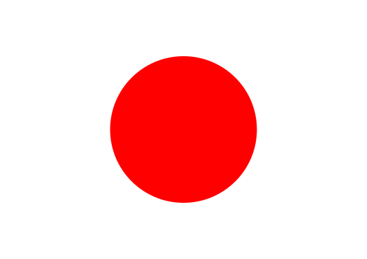
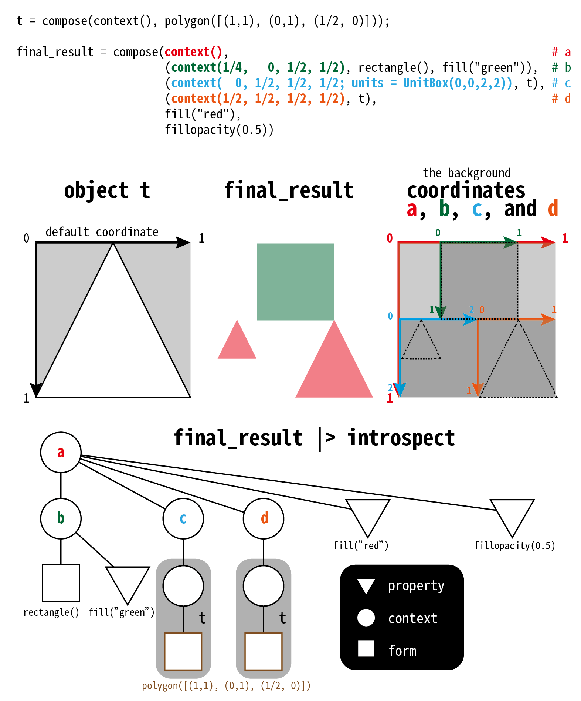
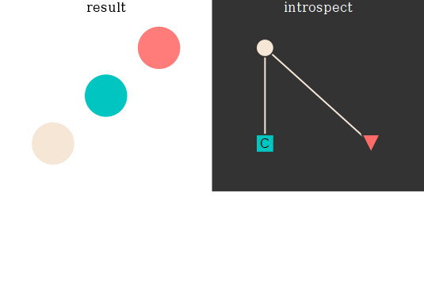
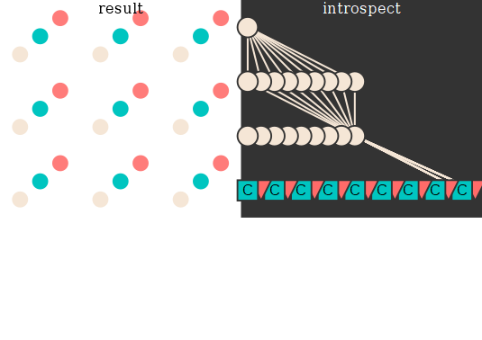
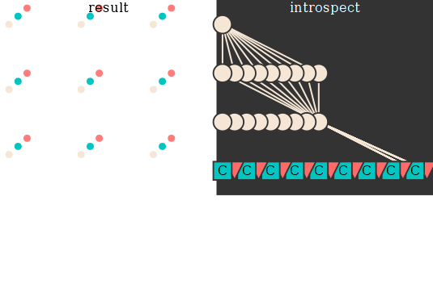
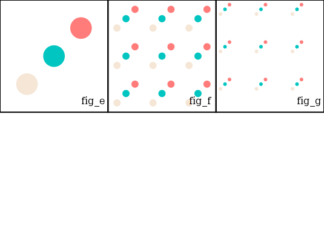
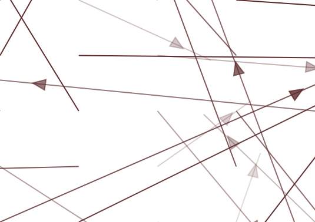

## Introduction
Compose creates graphics that can be further composed with others.
For example, create a circle of radius 0.2 centered at 0.5 filled with red color in the coordinate system with both x, y's range being [0,1] by default:


```julia
using Compose
compose(context(), fill("red"), circle(0.5,0.5,0.2))
```




Regarding the structure of the composed graphic as a tree, there are three important types for "member" in the tree:
- `Context`: an internal node that you may regard it as a "coordinate system"; it is created by `context()`.
- `Form`: a leaf node that defines geometry. For example, the `circle()`
- Property: a leaf node that gives a property to the `Form`. For example, `fill("red")`.

## Decomposition of composed object
`compose(a,b,c,ds...)` is in fact `compose(compose(a, b), c, ds...)`; with `compab = compose(a,b)`, it can further be rewritten to `compose(compose(compab, c), ds...)`.

## Introspect the structure of graphics
You can `introspect` the `compose`d graphic to see the relations between objects and properties.




## Vectorization
### Basic Example
Plot three circles of three colors:
```julia
# the x, y, r of the three circles:
xs = [0.25, 0.5, 0.75];
ys = [0.75, 0.5, 0.25];
rs = [0.1, 0.1, 0.1]; # or simply [0.1] is ok

# the colors to fill for the three circles
using Colors
colors = [LCHab(92, 10, 77), LCHab(68, 74, 192), LCHab(78, 84, 29)];

fig_e = compose(context(),
circle(xs, ys, rs), fill(colors));
```





Create a new coordinate system of 9 sub-coordinate system, put `fig_e` (the three circles) inside each sub-coordinate system:
```julia
# the start points of the 9 sub-coordinate systems
x0 = [0,0,0,1,1,1,2,2,2]./3;
y0 = [0,1,2,0,1,2,0,1,2]./3;
# and their x range and y range
xw = yh = 1.0./3;

subcoord(x0,y0) = (context(x0,y0,xw,yh), fig_e);
fig_f = compose(context(),
        subcoord.(x0,y0)... );
```





in which, `x0,y0,xw,yh` defines the position of the sub-coordinate system `context(x0,y0,xw,yh)` in `context()`'s space. 
The default x, y range of `context(x0,y0,xw,yh)` is [0,1], and you can redefine it by adding the `;units=UnitBox()` kwarg. 
`circle(xs, ys, rs)` in `fig_e`, is plotted in `context(x0,y0,xw,yh)`, in which, `xs`, `ys`, and radius `rs` define the three circles in `context(x0,y0,xw,yh)`.

If you redefine the scale of the coordinate system of `subcoord`, for example, that x, y coordinates ranges changed to [0,2], and `xs`, `ys`, and radius `rs` spans less portion of the axes of larger scale, they look smaller:
```julia
subcoord(x0,y0) = (context(x0,y0,xw,yh;units=UnitBox(0,0,2,2)), fig_e);
fig_g = compose(context(),
        subcoord.(x0,y0)... );
```





Here is the overview of `fig_e`, `fig_f`, `fig_g`:
```julia
h = 0.7;
w = 1/3;
box = (context(), rectangle(), fill(nothing),stroke("black"));
cap(str) = (context(), text(0.75,0.95,str),fill("black"));
compose(context(0.0,0.0,1.0,h), 
         (context(0.0,0.0,w,h), cap("fig_e"), fig_e, box), 
		 (context(1/3,0.0,w,h), cap("fig_f"), fig_f, box),
		 (context(2/3,0.0,w,h), cap("fig_g"), fig_g, box))
```




### Example: Vector Field

```julia
v1 = (0.5,0.5); # vector
absv = hypot(v1...); # length of vector
clr = stroke(RGBA(90/255,39/255,41/255,absv)) # color of arrow

"""
`unitarrow(arrangle, arrlength)` creates a good arrow. Noted that the maximum length of arrow should not exceeds 1.
"""
function unitarrow(arrangle, arrlength; arrwidth=0.1, arrheight=0.15)
	head_x =0.5 + 0.5*arrlength;
	center = (0.5, 0.5);
	headpoint = (head_x, 0.5);
	sidepoint_a = headpoint.+(-arrheight,-arrwidth/2);
	sidepoint_b = headpoint.+(-arrheight,arrwidth/2);
	function lim_x(sidepoint_a)
		sidepoint_a = maximum.(([sidepoint_a[1], center[1]], [sidepoint_a[2]]))
	end
	sidepoint_a = lim_x(sidepoint_a);
	sidepoint_b = lim_x(sidepoint_b);

	eq_triangle = [sidepoint_a,
				   sidepoint_b,
				   headpoint]
	tailwidth = arrwidth/5;
	arrowtail = (context(), polygon(
			[(1-headpoint[1],headpoint[2]-tailwidth/2),
			 (1-headpoint[1],headpoint[2]+tailwidth/2),
			 (sidepoint_a[1], headpoint[2]+tailwidth/2),
			 (sidepoint_a[1], headpoint[2]-tailwidth/2)
				]))
		# rectangle(headpoint[1]-tailwidth/2,0,tailwidth,1-arrheight))
	arrowheadx = (context(units=UnitBox(0,0,1,1)),polygon(eq_triangle));
	arw = compose(
		context(units=UnitBox(0,0,1,1), rotation=Rotation(arrangle, 0.5, 0.5)), 
		arrowheadx,
		arrowtail);
end

theta = atan(v1[2], v1[1])-pi/2;
unitarrow(theta, absv)
```


```julia
function mymeshgrid(rangex, rangey)
  xgrid = Float64[];
  ygrid = Float64[];
  for i in rangex
    for j in rangey
      push!(xgrid, i);
		push!(ygrid, j);
    end
  end
  return (xgrid, ygrid)
end
subcoord2(x0,y0,obj) = (context(x0,y0,1,1), obj);
subcoord1(x0,y0) = (context(x0,y0,1,1), rectangle(), stroke("black"), fill(nothing));

n = 5;
(xs, ys) = mymeshgrid(collect(0:n),collect(0:n));
m = length(xs);
thetas = rand(1:360, m) ./ (2pi);
arrlen = rand(1:100, m) ./ 100;
objs = unitarrow.(thetas, arrlen);
compose(context(;units=UnitBox(0,0,n+1,n+1)), 
        subcoord2.(xs,ys,objs)..., subcoord1.(xs,ys)...)
```


### Example: vector field 2
```julia
function arrowhead(θ)
	eq_triangle = [(0, 1/sqrt(3)),
		           (-1/3, -2/(2 * sqrt(3))),
		           (1/3, -2/(2 * sqrt(3)))]

	compose(context(units=UnitBox(-1,-1,2,2), rotation=Rotation(θ, 0, 0)),
				polygon(eq_triangle))
	# Rotation(θ, x, y): Rotate all forms in context around point (x,y) by angle θ in radians. 
end

function quiver(points, vecs)
	xmin = minimum(first.(points))
	ymin = minimum(last.(points))
	xmax = maximum(first.(points))
	ymax = maximum(last.(points))
	hs = map(x->hypot(x...), vecs)
	hs = hs / maximum(hs)

	vector(p, v, h) = all(iszero, v) ? context() :
		(context(),
		    (context((p.+v.*6 .- .2)..., .4,.4),
				arrowhead(atan(v[2], v[1]) - pi/2)),
		stroke(RGBA(90/255,39/255,41/255,h)),
		fill(RGBA(90/255,39/255,41/255,h)),
		line([p, p.+v.*8]))

	compose(context(units=UnitBox(xmin,ymin,xmax,ymax)),
         vector.(points, vecs, hs)...)
end


quiver([[(j-1,i-1) for i=0:n, j=0:n]...],
       [arrlen[i].*(cos(thetas[i]), sin(thetas[i])) for i = 1:length(thetas)])
```


