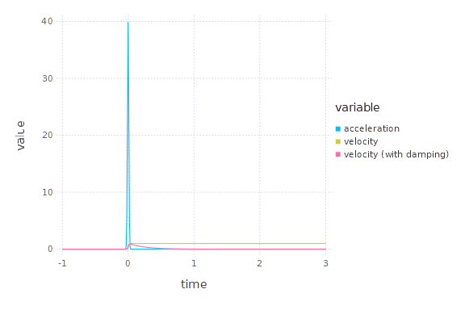
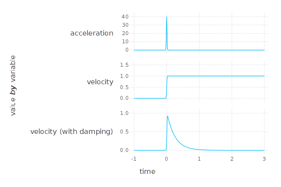
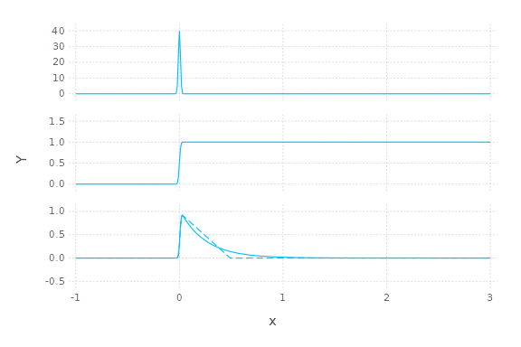

Of course, we need:
```julia
using Gadfly
using DataFrames
```


> **⚠️Notice:**: 
> If you're using `Weave.jl`, which render the figures depend on output png files, it is necessary to `using Cairo, Fontconfig` with Gadfly in order to output images in `png` format. For more information, see [this](https://discourse.julialang.org/t/im-not-able-to-use-gadfly-weave/47810/4).


## Multiple subplots with layers
### Prepare the data


Assuming you want to plot time (`T`) versus acceleration (`A`), velocity (`V`) and velocity with two kinds of damping (`Vc` and `Vv`).

Gadfly works especially great with `DataFrame` objects; so, 
firstly, create the Dataframe:
```julia
df_wide = DataFrame("time"=>T, "acceleration"=>A, "velocity"=>V, "velocity (with damping)"=> Vv);
```


```
A "wide" dataframe: 
┌─────┬───────┬──────────────┬──────────┬─────────────────────────┐
│ Row │  time │ acceleration │ velocity │ velocity (with damping) │
├─────┼───────┼──────────────┼──────────┼─────────────────────────┤
│   1 │  -1.0 │          0.0 │      0.0 │                     0.0 │
│   2 │ -0.99 │          0.0 │      0.0 │                     0.0 │
│   3 │ -0.98 │          0.0 │      0.0 │                     0.0 │
│ ... │   ... │          ... │      ... │                     ... │
│ 199 │  0.98 │          0.0 │      1.0 │               0.0190841 │
│ 200 │  0.99 │          0.0 │      1.0 │               0.0183207 │
│ ... │   ... │          ... │      ... │                     ... │
│ 399 │  2.98 │          0.0 │      1.0 │              5.43148e-6 │
│ 400 │  2.99 │          0.0 │      1.0 │              5.21422e-6 │
│ 401 │   3.0 │          0.0 │      1.0 │              5.00565e-6 │
└─────┴───────┴──────────────┴──────────┴─────────────────────────┘
(401 rows × 4 columns)
```


and convert it to "long" format:
```julia
# a long dataframe where the three variables are grouped by their column name
df_long = stack(df_wide, ["acceleration", "velocity", "velocity (with damping)"]);
```


```
The converted "long" dataframe: 
┌──────┬───────┬─────────────────────────┬────────────┐
│  Row │  time │                variable │      value │
├──────┼───────┼─────────────────────────┼────────────┤
│    1 │  -1.0 │            acceleration │        0.0 │
│    2 │ -0.99 │            acceleration │        0.0 │
│    3 │ -0.98 │            acceleration │        0.0 │
│  ... │   ... │                     ... │        ... │
│  600 │  0.98 │                velocity │        1.0 │
│  601 │  0.99 │                velocity │        1.0 │
│  ... │   ... │                     ... │        ... │
│ 1201 │  2.98 │ velocity (with damping) │ 5.43148e-6 │
│ 1202 │  2.99 │ velocity (with damping) │ 5.21422e-6 │
│ 1203 │   3.0 │ velocity (with damping) │ 5.00565e-6 │
└──────┴───────┴─────────────────────────┴────────────┘
(1203 rows × 3 columns)
```


### One subplot with three layers
Plotting the data _**by color**_ in one subplot, where the color is distinguished by the column `"variable"` (i.e., "acceleration", "velocity", or "velocity with damping"):

```julia
plot(df_long, x = "time", y="value", color="variable", Geom.line)
```




### Three subplots
Now we plot the 3 sets of data _**by group**_ in individual subplots respectively:
```julia
plot(df_long, x = "time", y="value", ygroup = "variable", 
     Geom.subplot_grid(Geom.line, free_y_axis=true))
```




### Three subplots
What if I want plot another velocity with another damping, saying `Vc`? 
Firstly, following the same procedure in [Prepare the data](#prepare-the-data), create a dataframe having "time", "value", and **a "variable" column** saying that the data also belong to "velocity (with damping)":
```julia
df_vdamp2 = DataFrame("time"=> T, "value"=> Vc, "variable"=> "velocity (with damping)")
```


```
┌─────┬───────┬────────────┬─────────────────────────┐
│ Row │  time │      value │                variable │
├─────┼───────┼────────────┼─────────────────────────┤
│   1 │  -1.0 │        0.0 │ velocity (with damping) │
│   2 │ -0.99 │        0.0 │ velocity (with damping) │
│ ... │   ... │        ... │                     ... │
│ 200 │  0.99 │ 5.35058e-9 │ velocity (with damping) │
│ ... │   ... │        ... │                     ... │
│ 401 │   3.0 │ 5.35058e-9 │ velocity (with damping) │
└─────┴───────┴────────────┴─────────────────────────┘
(401 rows × 3 columns)
```


```julia
# Gadfly.push_theme(style(line_style=[:solid])); # seems not required
plot(df_long, x = "time", y="value", ygroup = "variable", 
     Geom.subplot_grid(
        layer(Geom.line), # layer 1: df_long
        layer(df_vdamp2, x = "time", y="value", ygroup = "variable",
        Geom.line, style(line_style=[:dot])),
        free_y_axis=true)
	)
```


```julia
# Gadfly.push_theme(style(line_style=[:solid])); # seems not required
plot(Geom.subplot_grid(
	layer(df_long, ygroup = "variable", x="time", y="value", #color="color", 
			Geom.line)
	,layer(df_vdamp2, ygroup = "variable", x="time", y="value", #color="color", 
			Geom.line,style(line_style=[:dot]))
	,free_y_axis=true
	)
,Guide.ylabel("Y")
)
```


