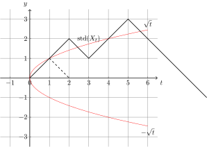
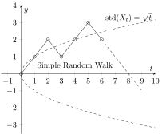

[TOC]
## Syntax
### Frequently used packages
```tex
\usepackage{graphicx} % to enable includegraphics[]{...}
\usepackage{amsmath} % for latex math
\usepackage[hidelinks]{hyperref} % Allows clickable reference lists
\usepackage{hyperref} % Allows clickable reference lists
```


<!-- ## Figure, Math and Table -->

### Item
```latex {cmd=true, hide=false}
\documentclass[a4paper]{article}
\begin{document}
\begin{itemize}
  \item Hello
  \item World
\end{itemize}
\end{document}
```
produce 


[Set the itemize bullet character](https://tex.stackexchange.com/questions/36443/how-to-change-the-nested-itemize-bullet-characters)
```latex
\documentclass{article}
\usepackage{enumitem}

\begin{document}
\begin{itemize} 
\item one \dots{}
     \begin{itemize}[label=$\star$]
        \item Language Models
        \item Vector Space Models
     \end{itemize}
\item two \dots{}
\item three \dots{}
\end{itemize}
\end{document}
```

### Figure
A simple figure
```latex
\begin{figure}[h]
\vspace{3mm}
\begin{center} % Figure caption aligned in center.
\includegraphics[width=12cm]{your-image-file.png}
\caption {Figure caption. \label{id-for-crossref}} % Figure caption
\end{center}
\vspace{-8mm}
\end{figure}	
```
> 🗝️ **Keys**
> - The `\begin{center} ... \end{center}` block makes the content (e.g. paragraph, figure, etc.) inside center-aligned. For more information, [see this](https://www.overleaf.com/learn/latex/Text_alignment).


A figure that spans only half-width of the page
```latex
\begin{figure}
\includegraphics[width=0.5\textwidth]{image-of-another-format.eps}
\caption{Also figure caption.}
\label{fig_happy} % refer this figure as `\ref{fig_happy}`
\end{figure}
```

A figure that spans the full-width of the page
```latex
\begin{figure*}
\includegraphics[width=\textwidth]{image-of-another-format.eps}
\caption{This is a nice figure.}
\label{fig_nice}
\end{figure*}
```

### Math
For example, 
```latex
\begin{equation}
F = ma
\end{equation}
```
### Table
[Basic Arguments for figure and table](http://web.mit.edu/molly/Public/rsi2006/figtab.pdf)
#### Adjust/Fit the table
[How to adjust a table to fit on page](https://tex.stackexchange.com/questions/121155/how-to-adjust-a-table-to-fit-on-page)
[Fit a large table in a page (uses `tabularx`, `adjustbox`)](https://stackoverflow.com/questions/48272281/latex-how-to-fit-a-large-table-in-a-page)
[A complicate multi-column big table fitted to page](https://tex.stackexchange.com/questions/424892/how-can-i-fit-this-table)
[How to force a table into page width](https://tex.stackexchange.com/questions/10535/how-to-force-a-table-into-page-width)
[How to fit a table to the width of the page?](https://stackoverflow.com/questions/71322673/how-to-fit-a-table-to-the-width-of-the-page)
[Fit a table without changing the font size](https://tex.stackexchange.com/questions/245853/fit-a-table-without-changing-the-font-size)

#### Table Position Alignment
[How to center the table in Latex](https://tex.stackexchange.com/questions/162462/how-to-center-the-table-in-latex)
[How can I center a too wide table?](https://tex.stackexchange.com/questions/39435/how-can-i-center-a-too-wide-table)


### Hyperlink
- For using `\href` or `\url`, right after `\documentclass` (e.g. `\documentclass{gji}`) we have to add
  - `\usepackage[urlcolor=blue,citecolor=black,linkcolor=black]{hyperref}` 
  - or simply `\usepackage{hyperref}`

- in manuscript, add url using `\href` or `\url`, for example: 
  - `\href{https://academic.oup.com/gji/pages/General_Instructions}{\textcolor{blue}{\underline{journal website}}}`
  - `\url{https://ccjou.wordpress.com/2012/05/25/%E5%BF%AB%E9%80%9F%E5%82%85%E7%AB%8B%E8%91%89%E8%BD%89%E6%8F%9B/}`


- ["the use of \bibliographystyle without using BibTeX is useless; that command is solely for BibTeX's benefit."](https://latex.org/forum/viewtopic.php?t=24571)

## Citation/Reference

### Use BibTeX
First, choose a bibliography style:
- `\bibliographystyle{plain}`: default
- `\bibliographystyle{gji}`: use the GJI style (`gji.bst` must exist in the same folder)
- `\bibliographystyle{apalike}`: use the built-in apa-like bibliography style (no need to have `apalike.bst`)
- See all the built-in bibliography styles [here](https://www.overleaf.com/learn/latex/Bibtex_bibliography_styles).

Second, 
- `\bibliography{main}`: Produce the bibliography via BibTeX based on `main.bbl`.

The `main.bbl` file is automatically generated using the `"xelatex -> bibtex -> xelatex*2"` recipe (see [Install & Setup #recipes](../latex-install/#recipes)) according to the `main.bib` file. 
You can generate `main.bib` using Zotero with Better BibTeX.

> **💡 Hint**
> - The best practice is to keep tex and bibtex has the same name, e.g., `main.tex` and `main.bib`, since bibtex must be run on the auxiliary file (e.g. `main.aux`), not the bibtex database. For more details, see [this](https://faculty.math.illinois.edu/~hildebr/tex/bibliographies0.html).
> - Also see: [Simple tutorial for how to use bibtex](https://blog.csdn.net/caiandyong/article/details/70258670)

> **❓ Why BetterBibTeX is recommended**
> - If not Better BibTeX, error may occurred due to some defects in the auto-generated `.bib` file (e.g., incorrect line break; unnecessary information, etc.).

#### BibTeX template
```
@article{eins1905,
    author =       "Albert Einstein",
    title =        "{Zur Elektrodynamik bewegter K{\"o}rper}. ({German})
        [{On} the electrodynamics of moving bodies]",
    journal =      "Annalen der Physik",
    volume =       "322",
    number =       "10",
    pages =        "891--921",
    year =         "1905",
    DOI =          "http://dx.doi.org/10.1002/andp.19053221004"
}

@book{latexcompanion,
    author    = "Michel Goossens and Frank Mittelbach and Alexander Samarin",
    title     = "The \LaTeX\ Companion",
    year      = "1993",
    publisher = "Addison-Wesley",
    address   = "Reading, Massachusetts"
}

@misc{knuthwebsite,
    author    = "Donald Knuth",
    title     = "Knuth: Computers and Typesetting",
    url       = "http://www-cs-faculty.stanford.edu/\~{}uno/abcde.html"
}
```
[Source](https://www.overleaf.com/learn/latex/Bibliography_management_with_bibtex)
### Manually write `bibitem`

Similar to procedure of [Use BibTeX](#use-bibtex), but you have to manually enter every entry and inline **author-year style** (e.g. [Fraklin, 1982]) of citation **is not supported**.

For example, 
```latex
\bibliographystyle{apalike}
{
\begin{thebibliography}{99}

\bibitem{Bezdek95}J.C. Bezdek and N.R. Pal. 
"Two soft relative of learning vector quantization".  
{\em Neural Networks}, vol.8, no.5, pp. 729-743, 1995.

\bibitem{Duda73}R.O. Duda, P.E. Hart.
"Pattern Classification and Scene Analysis".
Wiley, New York, 1973.

\bibitem{Bezdek81}J.C. Bezdek.
"Pattern Recognition with Fuzzy Objective Function Algorithms".
Plenum Press, New York, 1981.

\bibitem{Krishnapuram93}
R. Krishnapuram and J.M. Keller.
"A possibilistic approach to clustering".
{\em IEEE Transactions on Fuzzy Systems}, 1:98--110, 1993.

\bibitem{Rose90}
K. Rose, E. Gurewitz, G. Fox.
"A deterministic approach to clustering".
{\em Pattern Recognition Letters}, vol.11, pp. 589-594, 1990.

\end{thebibliography}
}
```

### `natbib` (Natural Sciences Citations and References)

In brief, `natbib` that allows `\citet`, `\citep`.
For example, 
- `\citep{eins1905}` produces `(Einstein, 1905)`
- `\citet{eins1905}` produces `Einstein (1905)`

Without using `natbib.sty`, `\cite` produces, for example, `(Einstein, 1905)` by default.

#### How to use
1. [download the natabib package](https://ctan.org/pkg/natbib?lang=en)
2. Unzip the file (probably named as `natbib.zip`), and you should find a file named `natbib.ins`.
3. Suppose the file is unzipped to `dir/to/natbib`; in shell (e.g. command window `cmd`), do 
   - `cd dir/to/natbib`
   - `LaTeX natbib.ins`
4. After that, you got the `natbib.sty` in the same folder.
5. Copy `natbib.sty` to your project (e.g. where `main.tex` exists), and add `\usepackage{natbib}`
6. Now you can use `\citet` and `citep`

> **💩Explain:**
> - `dir/to/natbib` is a pseudo name referring the directory (folder) you placed the `natbib.ins`; that is, you have `dir/to/natbib/natbib.ins`.
> - `main` is also a pseudo name; you can name your tex file arbitrarily such as `my_doc.tex` or `article_one.tex`.

The natbib package also provides alternative bibliography styles, `abbrvnat.bst`, `plainnat.bst` and `unsrtnat.bst`, that you can use either of them via the syntax `\bibliographystyle`. 
For example, `\bibliographystyle{abbrvnat}` makes the first name of an author you cited abbreviated in the References section.

#### Resources
- http://merkel.texture.rocks/Latex/natbib.php?lang=en
- https://www.itread01.com/content/1544600046.html
- https://blog.csdn.net/GeneralLi95/article/details/78708081

### Others
#### Without BibTeX
(not figured out yet)
```latex
\begin{references}
\reference
\end{references}
```
[generate references with and without BibTex](https://www.cnblogs.com/yifdu25/p/8330652.html)


#### biblatex
https://tex.stackexchange.com/questions/12175/biblatex-submitting-to-a-journal/12185#12185


## Debug 
### Stupid Error
- in some cases the naming in `.bib` file may cause error. For example, with [AIP's template](https://www.overleaf.com/latex/templates/template-for-submission-to-aip-publishing-journals/xhsskcchtbxf), it is ok to have entries with bottom line (e.g. `@Article{telesca_2017,...}`) but for gji class (`gji.cls`), bottom line should be removed (e.g. `@Article{telesca2017,...}`) otherwise error occurred using "xelatex -> bibtex -> xelatex*2".
- white space between entries in one `\cite{...}`. e.g.: 
  - `\cite{tomblabla2002, jerrymewmew2001}` will raise an error
  - `\cite{tomblabla2002,jerrymewmew2001}` is ok
- If a package that was able to be properly built but failed now, try to build using the same device that was used; and sync on vscode across devices may solve the problem.

## Explained with specific templates
### Homework Template
```
\documentclass[a4paper]{article}
\usepackage{amsmath}
\usepackage{amssymb}
\usepackage{geometry}
\geometry{left=2.5cm,right=2.5cm,top=2.5cm,bottom=2.5cm}

\title{Probability Homework 8 Solution}
\author{Your Name\\
	whatever\\
	\ttfamily{your@email.com}}

\begin{document}
\maketitle
\section{Problem 1}

\end{document}
```

### GJIRAS
Here is the [official template](https://www.overleaf.com/latex/templates/template-for-geophysical-journal-international-gjiras/zjhxtdhcnprg) for GJI publication.
However, the template `gjiguide2e.tex` or `gji_extraguide.tex` alone does not produce the correct format; we have to not only integrate the two but with some additional packages in order to make it work correctly.

Based on the `gjiguide2e.tex` template:
```
\documentclass{gji} % refers to gji.cls 

%% SECTION I %%
\usepackage{timet,color}

% \author, \title \date \pubyer... etc. are not displayed here

%% SECTION II %%
\begin{document}
\label{firstpage}

% from abstract to acknowledgments...

%% SECTION III %%

\label{lastpage}
\end{document}

```
we can enable the following functionality:

- **Hyperlink of citation to bibliography**: add `\usepackage[urlcolor=blue,citecolor=black,linkcolor=black]{hyperref}` to `SECTION I`
- **to enable `includegraphics[]{...}`**: add `\usepackage{graphicx}` to `SECTION I`
- **to enable latex math**: add `\usepackage{amsmath}` to `SECTION I`
- **additional facilities (allow `\citet`, `\citep`, etc.)**: 
  - change `\documentclass{gji}` to `\documentclass[extra]{gji}`
  - Add `\usepackage{gji_extra}` to `SECTION I`. This is superfluous; at the end of `gji.cls` we can see `gji_extra.sty` has already been used:
    ```
    \ifGJ@extra
    \def\refname{REFERENCES}
    \usepackage{gji_extra}
    \fi
    ```
  - disable/delete `\usepackage{timet}` in `SECTION I`; otherwise it applies `timet.sty` and the previous `\usepackage{gji_extra}` is voided.
- producing the bibliography via BibTeX. 
  - add `\bibliographystyle{gji}` in `SECTION I`
  - Add for example `\bibliography{main}` in `SECTION III` right before `\label{lastpage}`.
  - In this example, `main.bib` have to be generated (use Zotero with BetterBibTex is recommended)
    
The modified one with all facilities above applied will be like:
```
\documentclass[extra]{gji} % refer to gji.cls 
\usepackage[urlcolor=blue,citecolor=black,linkcolor=black]{hyperref}
\usepackage{graphicx} % to enable includegraphics[]{...}
\usepackage{amsmath} % for latex math
\bibliographystyle{gji} 

\usepackage{gji_extra} % This is superfluous, 
% since this in fact the second time executes `\usepackage{gji_extra}`; 
% the first time is in the end of `gji.cls` as the `extra` option is specified.

% \author, \title \date \pubyer... etc. are not displayed here

\begin{document}
\label{firstpage}

% from abstract to acknowledgments...

\bibliography{main}% Produces the bibliography via BibTeX. (e.g. main.bib)
\label{lastpage}
\end{document}

```

Other key points I learned:

- `gji.bst` is created automatically when applying `\bibliographystyle{gji}`. The content are generated according to bibtex (e.g., `main.bib`).

If there is something in generating the `.bst` file (i.e. it is not properly generated), you can temporarily use a built-in bibliography style while editing (for example, use `\bibliographystyle{apalike}` instead). If unfortunately the bug have not able been found, we can manually copy-and-paste the entries in the `.bbl` file that generated with the not-working bibliography style into the manuscript after the manuscript is 100% ready.
> That is, after the article is finished, generate the `.bbl` file with `\bibliographystyle{gji}`, then copy the `\thebibliography` section inside and manually fix all the error, and replace `\bibliography{main}` by this modified `\begin{thebibliography}{}...\end{thebibliography}` section (i.e. delete `\bibliography{main}` and put the `\thebibliography` section right before `\label{lastpage}` and `\end{document}`.


#### The submission style
Output the one-column version of copy by switching from `\documentclass[extra]{gji}` to `\documentclass[extra,mreferee]{gji}`.

## Drawing
### Tikz

> **💡 With Markdown Preview Enhanced, you can view the plotting results directly!**
> - Press `ctrl+shift+enter` to execute all codes in `.md` file in vscode editor and display the results on Markdown Preview Enhanced

```latex {cmd=true, hide=false}
\documentclass{standalone}
\usepackage{tikz}
\begin{document}
\begin{tikzpicture}

\draw[thick,->] (-1.5,0) -- (6.5,0) node[anchor=north west] {$t$};
\draw[thick,->] (0,-3.5) -- (0,3.5) node[anchor=south east] {$y$};
\foreach \x in {-1,0,1,2,3,4,5,6}
\draw (\x cm,2pt) -- (\x cm,-0pt) node[anchor=north] {$\x$};
\foreach \y in {-3,-2,-1,1,2,3}
\draw (2pt,\y cm) -- (-0pt,\y cm) node[anchor=east] {$\y$};
\draw[step=1.0 ,help lines, thin] (-1.5,-3.5) grid (6.5,3.5);	


\draw[rotate=-90, color=red] (-2.45,6) parabola bend (0,0) (2.45,6);
\draw (6,2.45) node[above] {$\sqrt{t}$}; % Latex Math
\draw (6,-2.45) node[below] {$-\sqrt{t}$}; % Latex Math
% \draw (3,2.0) node[rotate=11, color=red] {$\mathrm{std}(X_t)$}; % Latex Math
\draw (3,2) node[rotate=0, color=black] {$\mathrm{std}(X_t)$}; % Node label in Latex Math
\draw[thick] (0,0) -- (1,1) -- (2,2) -- (3,1) -- (4,2) -- (5,3) -- (9,-1);
\draw[dashed, thick] (1,1) -- (2,0);

\end{tikzpicture}
\end{document}
```



### pgfplots
or use pgfplots
```latex {cmd=true, hide=false}
\documentclass{standalone}
\usepackage{tikz}
\usepackage{pgfplots}
\usetikzlibrary{matrix}
\begin{document}
\begin{tikzpicture}
\begin{axis}[ % please \usepackage{pgfplots} first
axis lines = middle,
xlabel=$ t$, ylabel=$ y$,
xmin=-1.5, xmax=10,
ymin=-3.5, ymax=4,
xtick distance=1, ytick distance=1 % try also xtick={0,...,4}, xtick distance=2
]
% Plot line/curve according to a parametric equation
% Line styles: dashed, solid... and many more
\addplot[domain=-6:6,samples=40, dashed] ({x^2},{x});
% Plot a point and a label
% set 1. angle away from the point; 2. label string; 3. the coordinate of the point
% `180` means the label will be put on west; similarly, `0` on east, `90` on north, etc. 
\node[label={90:{$\mathrm{std}(X_t)=\sqrt{t}$}}] at (axis cs:8,2.7) {};
% NOTE that NO COMMENT inside the table {}
% use line break to separate new points
% You may also try `table {datafile.dat}`
% you may delete `mark=o` to make markers solid
% you may delete `only marks` to have marks linked
\addplot [mark=o] table {
0 0
1 1
2 2
3 1
4 2
5 3
6 2
};
\addplot [dashed] table {
6 2
9 -1
};

% Plot a point and a label
% set 1. angle away from the point; 2. label string; 3. the coordinate of the point
% `180` means the label will be put on west; similarly, `0` on east, `90` on north, etc. 
\node[label={-90:{Simple Random Walk}}] at (axis cs:4,1) {};
\end{axis}
\end{tikzpicture}
\end{document}
```


## Resources That Might Be Useful
[Frequently Asked Question List for TeX](http://www.texfaq.org/index#bibliographies)
[latex math](https://en.wikibooks.org/wiki/LaTeX/Mathematics)
[BibTeX, natbib, biblatex](https://guides.library.yale.edu/bibtex/workshop)