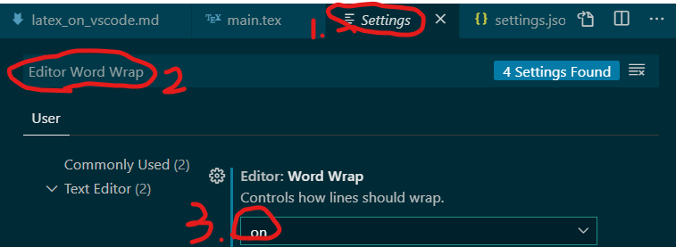
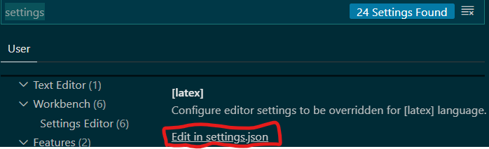

[TOC]

## Installation
### Download (textlive)
- download [texlive](http://tug.org/texlive/), run `install-tl-windows.exe` **as administrator**.
  - it takes several hours to install
  - you may alternatively choose `other methods`> `Downloading one huge ISO file`>`texlive.iso` > unzip > execute  `install-tl-windows.bat`
    - **`install-tl-windows.bat` and associated files must be placed at the system disk (e.g. C:\\)**
  - It is unnecessary to install TexWorks.
#### Check integrity (optional)
Check integrity of the file (optional)
- open command window
- go to the directory where there is the texlive2020.iso
  - e.g. `cd D:\Users\HSI\Downloads`
- `CertUtil -hashfile texlive2020.iso SHA512` to get the checksum, and compare the result with that of the owners side. (e.g. `texlive2020.iso.sha512` on the official website). [see this for more information](https://security.stackexchange.com/questions/189000/how-to-verify-the-checksum-of-a-downloaded-file-pgp-sha-etc)

### Install

- Add `C:\texlive\2020\bin` to PATH (系統內容>進階>環境變數>PATH反白>編輯>新增>確定) (or add `C:\texlive` to PATH).
- Make sure `C:\Users\HSI\AppData\Local\Programs\Microsoft VS Code\bin` is also added to PATH.

- install LaTeX Workshop in VS Code
  - `james-yu.latex-workshop`, James Yu

### Basic control (vscode)

#### UI and shortcut
Here are some hints for using Latex Workshop package in vscode:

- view latex PDF file with `Ctrl`+`Alt`+`V`
- open a `xxx.tex` file in vscode
- click the TEX button on the left (below the button for packages) to show commands for > latex workshop

- `Ctrl`+`Right Click`: Sync backward (Jump to the line according to cursor in PDF)
- `Ctrl` + `Alt` + `j`: Sync forward (Jump to the line according to cursor in tex)


- switch word wrap on and off: 
  - add `"editor.wordWrap":"on",` in `settings.json`, or
  - 


## Configuration (vscode)
- Configure editor settings in `settings.json`
  - file > Preferences > Settings
  - 

- For other settings in `settings.json`, see [link](https://blog.ceba.tech/2018/11/Visual-Studio-Code-LaTeX/index.html), [link](https://zhuanlan.zhihu.com/p/38178015), [link](), [link](https://blog.csdn.net/liu6tot/article/details/104243625).
- For setting zotero, see (https://zhuanlan.zhihu.com/p/108095566).

### Tools
Add latex tools that are going to be used in your recipes:
- latexmk
- xelatex: for Chinese support
- pdflatex
- bibtex: Rendering the bibliography from an outer `.bib` file failed because `.bbl` is not created. To create `.bbl` file, as described before, `bibtex` is required.
- biber

```
    "latex-workshop.latex.tools": [
        {
            "name": "latexmk",
            "command": "latexmk",
            "args": [
            "-synctex=1",
            "-interaction=nonstopmode",
            "-file-line-error",
            "-pdf",
            "%DOC%"
            ]
          },
          {
            "name": "xelatex",
            "command": "xelatex",
            "args": [
            "-synctex=1",
            "-interaction=nonstopmode",
            "-file-line-error",
            "%DOC%"
              ]
          },          
          {
            "name": "pdflatex",
            "command": "pdflatex",
            "args": [
            "-synctex=1",
            "-interaction=nonstopmode",
            "-file-line-error",
            "%DOC%"
            ]
          },
          {
            "name": "bibtex",
            "command": "bibtex",
            "args": [
            "%DOCFILE%"
            ]
          },
          
          {
              "name": "biber",
              "command": "biber",
              "args": [
                  "%DOCFILE%"
              ]
          }
        ],
```

### Recipes
Define your recipes; the first one is the default recipe to use when you `Crtl+S`.
If one recipe failed, Latex Workshop will try the next one.
```
    "latex-workshop.latex.recipes": [     

      


          {
            "name": "xelatex -> bibtex -> xelatex*2",
            "tools": [
            "xelatex",
            "bibtex",
            "xelatex",
            "xelatex"
                        ]
                  },      

          {
            "name": "latexmk",
            "tools": [
            "latexmk"
                        ]
          },                        
                  
          {
            "name": "xelatex",
            "tools": [
            "xelatex"
                        ]
                  },


                  
          {
            "name": "pdflatex -> bibtex -> pdflatex*2",
            "tools": [
                "pdflatex",
                "bibtex",
                "pdflatex",
                "pdflatex"
            ]
          },
 
          {
              "name": "xelatex -> biber -> xelatex*2",
              "tools": [
                  "xelatex",
                  "biber",
                  "xelatex",
                  "xelatex"
              ]
          }

        ],
```

> **💁Explain:**
> - The `bibtex` command in `"xelatex -> bibtex -> xelatex*2"` or `"pdflatex -> bibtex -> pdflatex*2"` is for generating the `.bbl` file, which is necessary for bibliography using bibtex.
> - You should run bibtex or biblatex to generate the bbl file. It is not done automatically.
> - What I used to do, is first run pdflatex and then bibtex followed by two times pdflatex. Because Bibtex needs the auxiliary file to generate the bbl file.
> - [Also see this](https://tex.stackexchange.com/questions/354196/bbl-file-not-generated), and [vscode latex 踩坑记 - 文献索引 bib 文件和setting.json的那点事](https://blog.csdn.net/lishu14/article/details/102774145), [vscode 折騰記](https://blog.ceba.tech/2018/11/Visual-Studio-Code-LaTeX/index.html), [VS Code + LaTeX 知乎](https://zhuanlan.zhihu.com/p/108095566), and [LaTeX+ VSCode参考文献编写](https://blog.csdn.net/zxyhappiness/article/details/98639094)


### Others
#### latex-workshop.latex.clean.fileTypes
Define types of auxiliary files to be automatically cleaned up:
```
    "latex-workshop.latex.clean.fileTypes": [
            "*.aux",
            "*.bbl",
            "*.blg",
            "*.idx",
            "*.ind",
            "*.lof",
            "*.lot",
            "*.out",
            "*.toc",
            "*.acn",
            "*.acr",
            "*.alg",
            "*.glg",
            "*.glo",
            "*.gls",
            "*.ist",
            "*.fls",
            "*.log",
            "*.fdb_latexmk"
          ],
```

#### No use to me
The following seems no use to me:
```
      "latex-workshop.synctex.afterBuild.enabled": true, // 启用反向搜索 （在 PDF 预览器中按下 Ctrl + ←，同时鼠标点击要反向搜索的位置）
```


