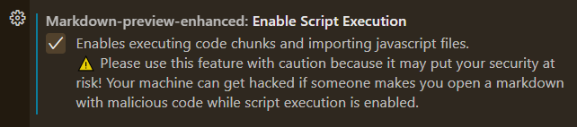
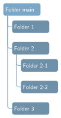

[TOC]

## General
### table of content
`[TOC]` in a markdown script is accepted in many places. In the case where there is no support of the `[TOC]` syntax, you may consider manually construct the table of contents like:
```md
- [Introduction](#introduction)
- [Documentation](#documentation)
  - [Main Functions](#main-functions)
```

## Markdown preview enhanced (MPE)

### `@import`
https://jonny-huang.github.io/projects/02_markdown_preview_enhanced/

With MPE, you can import external files

import another markdown:
@import "test_import.md"


> The imported external file is displayed only in MPE


#### `@import` figure, `.csv`, and many more
import `png`:
@import "MIT_StochasticProcess_Lecture.png"


> The picture is displayed only in MPE


`.gif` is OK!
@import "anim_fps15.gif"

> The animation is displayed only in MPE


you can event import a `.csv` file as a table!
@import "test_import.csv"


The table is displayed only in MPE


### code chuck execution
- you have to make `enableScriptExecution` to be true first: find/add this option/line in `settings.json` or check the box:
 
#### latex: draw figures using Tikz
- added pdf2svg and texlive to PATH. 請在搜尋框搜尋"編輯環境變數". texlive and pdf2svg should have been installed/downloaded first. For more information, see [this](https://shd101wyy.github.io/markdown-preview-enhanced/#/zh-tw/code-chunk) and [download pdf2svg here](http://cityinthesky.co.uk/opensource/pdf2svg/).
- `ctrl+shift+enter` to execute all code blocks, or `shift+enter` to execute a single block, or press the buttons in the top-right corner of each code block. For more information, see [Markdown Preview Enhanced (Official)](https://github.com/shd101wyy/markdown-preview-enhanced/blob/master/docs/code-chunk.md).

```latex {cmd=true}
\documentclass{standalone}
\begin{document}
   Hello world!
\end{document}
```


```latex {cmd=true hide=true}
\documentclass{standalone}
\usepackage{tikz}
\usetikzlibrary{matrix}
\begin{document}
\begin{tikzpicture}
  \matrix (m) [matrix of math nodes,row sep=3em,column sep=4em,minimum width=2em]
  {
     F & B \\
      & A \\};
  \path[-stealth]
    (m-1-1) edge node [above] {$\beta$} (m-1-2)
    (m-1-2) edge node [right] {$\rho$} (m-2-2)
    (m-1-1) edge node [left] {$\alpha$} (m-2-2);
   \draw (2,0) node[rotate=0, color=black, above right] {You won't see this unless code is executed}; % Node label in Latex Math
\end{tikzpicture}
\end{document}
```

##### save the figure
The following code successfully executed, but I didn't know where do the picture being saved...
- [How can I use Tikz to make standalone (SVG) graphics?](https://tex.stackexchange.com/questions/51757/how-can-i-use-tikz-to-make-standalone-svg-graphics)

```latex {cmd=true, hide=true}
% \documentclass[tikz,convert={outfile=\jobname.svg}]{standalone}
\documentclass[convert]{standalone}
% \documentclass[convert={density=300,size=1080x800,outext=.png}]{standalone}
% \documentclass[crop,tikz,convert={outext=.svg,command=\unexpanded{pdf2svg \infile\space\outfile}},multi=false]{standalone}[2012/04/13]
\usepackage{tikz} % this is done by adding `tikz` in the documentclass option; thus, usepackage is not required.
\usepackage{pgfplots} % uncomment this if you use pgfplots
\usetikzlibrary{matrix}
\begin{document}
\begin{tikzpicture}
\begin{axis}[ % please \usepackage{pgfplots} first
axis lines = middle,
xlabel=$ x$, ylabel=$ y$,
xmin=-5, xmax=5,
ymin=-2, ymax=10,
xtick=\empty, ytick=\empty % try also xtick={0,...,4}, xtick distance=2
]
% Plot line/curve according to function
% Line styles: dashed, solid... and many more
\addplot [domain=-5:5, samples=50, solid] {0.5*x^3+2*x^2+2*x+1};
\end{axis}
\end{tikzpicture}
\end{document}
```


```latex {cmd=true, hide=true}
\documentclass[border=5pt]{standalone}
\usepackage{forest}

\definecolor{folderbg}{RGB}{124,166,198}
\definecolor{folderborder}{RGB}{110,144,169}

\def\Size{4pt}
\tikzset{
  folder/.pic={
    \filldraw[draw=folderborder,top color=folderbg!50,bottom color=folderbg]
      (-1.05*\Size,0.2\Size+5pt) rectangle ++(.75*\Size,-0.2\Size-5pt);  
    \filldraw[draw=folderborder,top color=folderbg!50,bottom color=folderbg]
      (-1.15*\Size,-\Size) rectangle (1.15*\Size,\Size);
  }
}

\begin{document}

\begin{forest}
  for tree={
    font=\ttfamily,
    grow'=0,
    child anchor=west,
    parent anchor=south,
    anchor=west,
    calign=first,
    inner xsep=7pt,
    edge path={
      \noexpand\path [draw, \forestoption{edge}]
      (!u.south west) +(7.5pt,0) |- (.child anchor) pic {folder} \forestoption{edge label};
    },
    before typesetting nodes={
      if n=1
        {insert before={[,phantom]}}
        {}
    },
    fit=band,
    before computing xy={l=15pt},
  }  
[Folder main
  [Folder 1
  ]
  [Folder 2
    [Folder 2-1
    ]
    [Folder 2-2
    ]
  ]
  [Folder 3
  ]
]
\end{forest}

\end{document}
```

```latex {cmd=true, hide=true}
\documentclass[border=5pt]{standalone}
\usepackage{forest}
\definecolor{color1}{RGB}{110,144,169}
\definecolor{color2}{RGB}{124,166,198}
\def\Size{4pt}

\begin{document}
\begin{forest}
  for tree={
    font=\sffamily,
    text=white,
    text width=2cm,
    minimum height=0.75cm,
    if level=0
      {fill=color2}
      {fill=color1},
    rounded corners=4pt,
    grow'=0,
    child anchor=west,
    parent anchor=south,
    anchor=west,
    calign=first,
    edge={color2,rounded corners,line width=1pt},
    edge path={
      \noexpand\path [draw, \forestoption{edge}]
      (!u.south west) +(7.5pt,0) |- (.child anchor)\forestoption{edge label};
    },
    before typesetting nodes={
      if n=1
        {insert before={[,phantom]}}
        {}
    },
    fit=band,
    s sep=15pt,
    before computing xy={l=15pt},
  }
[Folder main
  [Folder 1
  ]
  [Folder 2
    [Folder 2-1
    ]
    [Folder 2-2
    ]
  ]
  [Folder 3
  ]
]
\end{forest}
\end{document}
```
