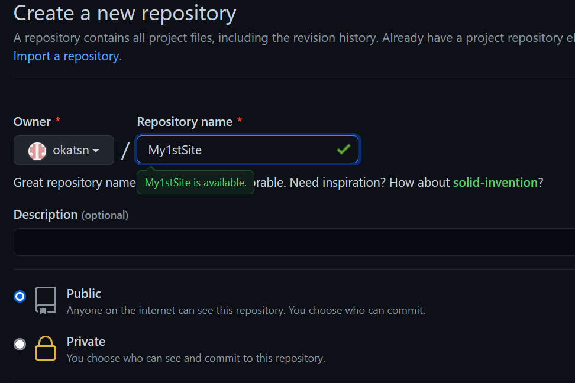
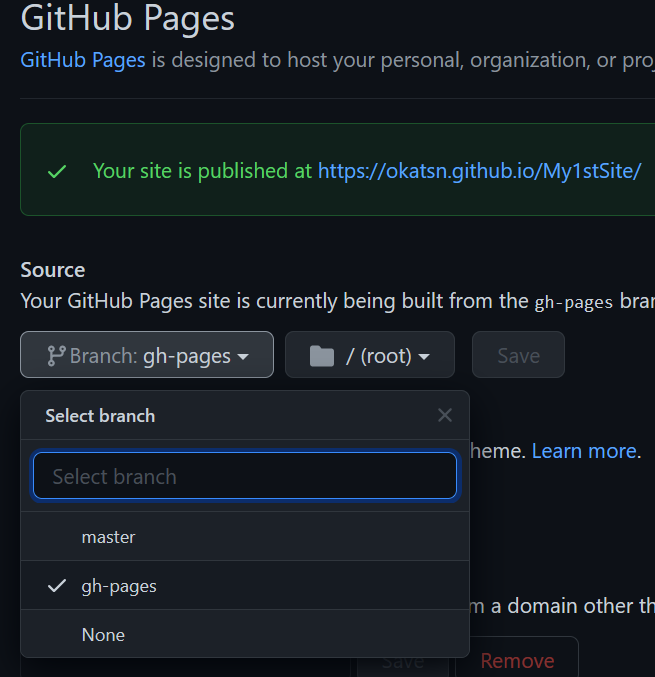

[TOC]


Before you start, you have to know how to code with [julia](https://julialang.org/), and how to write documents with [Markdown](https://markdown.tw/).

## Deploy your website the first time
### Create your site on local using Franklin's template
In julia REPL, 
```julia-repl
julia> using Pkg
julia> Pkg.activate(mktempdir())
julia> Pkg.add("Franklin")
julia> using Franklin
julia> newsite("My1stSite"; template="hyde"); 
julia> serve(); # view the website instantly on your browser
```

> **💡Hint**:
> - This site is based on the template "Hyde"; go to [FranklinTemplates.jl](https://tlienart.github.io/FranklinTemplates.jl/) to discover more templates!
> - Noted that after `newsite("My1stSite"; template="hyde")`, the current directory changed to `..\\My1stSite`; but in bash [^expbash], the current directory won't change so you have to change it manually following the later instruction.
> - `My1stSite` can be replaced by any name you like; `okatsn` should be replaced by your own account name on Github.

> **🗝️Key points**
> - Change current directory in REPL by using `cd(".\\MyFirstSite")` if it is required.

[^expbash]: In the terminal window of bash, which is a Unix shell. 

### Publish the repository and deploy your site

Create a repository on Github first, 




In bash, 
```bash
$ cd D:\\GoogleDrive\\1Programming\\julia\\My1stSite
$ git init && git remote add origin https://github.com/okatsn/My1stSite.git
$ git add -A && git commit -am "initial files"
$ git push --set-upstream origin master
```
> **💡Hint**:
> - If you create and publish your repository on your local machine such as Github Desktop or vscode with GitLens, just `git push` instead of `git push --set-upstream origin master`.
> 
> **💩Explanation**:
> - See [Notes/Git](../../git).

Now, go to your repository (e.g., `https://github.com/okatsn/My1stSite`) > `Settings` > `Pages` > select the branch "gh-pages" and click on `Save`.
> **💡Hint**:
> - You should wait a couple of minutes for checks to be completed; if all checks for this commit have passed, you are able to see the "gh-pages" branch.




Now go back to bash, 
```bash
$ git fetch # to let your local machine know there is a remote branch
$ git checkout gh-pages # switch current branch to the remote branch "gh-pages"
$ git add . # stage new & modified changes (deleted files won't be staged)
$ git commit
$ git push
```

> **💡Hint**:
> - These can also be done on vscode with GitLens: In the options of SOURCE CONTROL, select `checkout to..` for switching branch; then, stage all changes, commit and push.
> 
> **⚠️Warning**
> - Commit and push on branch `gh-pages` should have only been done ONCE manually. After that, always commit and push on branch e.g. `master` or something else (BUT NOT on `gh-pages`); the update of `gh-pages` should be done automatically while checking.
> - On github, without doing anything, branch `master` should be the default branch.
> - In your local machine, no matter you are using vscode with GitLens or Git bash, you MAY NEED to manually switch the branch to `master` or something IF it is currently on `gh-pages` (e.g. you should `$git checkout master` in bash before editing anything).
> 
> **:poop:More explantion about the branch `gh-pages`**
> Franklin publish your website as the branch of `gh-pages`.
> Simply speaking, when you write your content in markdown on the branch for example `master`, commit on this branch, and push, your website is accordingly automatically generated and push to the branch `gh-pages`. These works were done on github; for more information, you may go to `..\My1stSite\.github\workflows\Deploy.yml` to see what have been done every time a commit on `master` is pushed to github.
> In brief, `master` is for development and any modification; all pull requests should be submitted against master. > Contents on `gh-pages` should be automatically and accordingly generated for the hosted site, which includes our analytics tracking code; please avoid using this branch.


### Deploy your website after some changes have been made
Now you may have made some changes on the files (such as `index.md`) and want to update the site.
- commit and push should be always on a branch (e.g., `master`) other than `gh-pages`
- commit and push
- after all checks for this commitment complete (these checks were done on github), your site is updated; generally it takes several minutes and you can see the progress on github on the page of your repository e.g. "My1stSite".


### If the website is not properly deployed
- Generally, run `serve()` before you deploy your website to make sure the locally rendered site is fine.
  - Make sure the current directory is the folder of the site (e.g., `My1stSite`)
  - `(@1.6) pkg> activate .` and `(My1stSite) pkg> instantiate` may be required in order to `using Franklin` and use `serve()`
- Make sure all checks have passed on Github
- `Manifest.toml` may result in error when deploying the site (that we can see on your Github repository, for example, "All checks have failed/passed" for a certain commit & push). Add `/Manifest.toml` to `.gitignore` may solve the problem.

### In final
#### Go to `config.md` 
Go to `config.md` to define some global variables that will be applied in html script; e.g., variable `author` will be referred by the syntax `{{fill author}}` in certain html files.
- set the author to your name (e.g., `author = "Tsung-Hsi"`); then you will see the bottom of the web page as well as the side menu showing your name.
- Add `@def prepath = "My1stSite"` in the `config.md`; see [here](https://franklinjl.org/workflow/deploy/#creating_a_repo_on_github) for why.

#### define what to show on tab
Add for example `@def title = "Introduction to Bla"` in the very beginning of a page named for example `subpage1.md`, and the opening tab of the browser will display "Introduction to Bla"; otherwise, "subpage1" will be displayed on the tab.
#### veryfy and optimize
(TODO)
- you may verify links with `Franklin.verify_links()` 

## Create your pages
### subpages
Just create a `.md` file under a certain subfolder (main folder is also ok), and show the link on page like this: [my first subpage](/pages/whatever1). The link above is created by adding `[my first subpage](/pages/whatever1)` in your markdown script.

> ⚠️ You can also directly put a static html file, for example, `/pages/myHomeWork/index.html` (or equivalently `/pages/myHomeWork.html`), and link to either by adding `[This is my homework](/pages/myHomeWork)`. **However, in this way the sidebar will dissapear**. To avoid sidebar to disapear, you have to `insert` the html file inside a markdown, as below.

#### A subpage of static html file: ``{{insert ...}}``

There are two ways to include a html file as a subpage (**note the differences**):
- [Directly link to a html file](/pages/html/test) 
  - This link is created by `[Directly link to a html file](/pages/html/test)`
- [Insert a html file](/pages/ForInsertTest)  
  - This link is created by `[Insert a html file](/pages/ForInsertTest)`, in which `ForInsertTest.md` is a markdown document having `{{ insert ../pages/html/test.html }}` as its content.

Usually, the second is preferred since the sidebar is preserved. 
That is, linking to a static `.html` file (created elsewhere) though a markdown file using the syntax `{{insert ../your/path/to/whatever.html}}` is preferred.

> **⚠️ Notice**:
> - Remember add `@def title="test (or any label string like)"`; otherwise, the string shown on the tab will be the file path and hence ugly.
> - Noted that `{{ insert fpath }}` the file path (`fpath`) in default is regarded relative to the `_layout` folder. To access file/directory outside the `_layout`, add an addtional `..` (i.e. `{{ insert fpath }}` $\rightarrow $ `{{ insert ../fpath }}`. See [this thread](https://github.com/tlienart/Franklin.jl/issues/813) for more information.
> 


#### How about a Pluto notebook?
You might think you can have a at least static Pluto notebook as a web page, since a Pluto notebook can be converted to static html file. For example, [Link to the markdown file where the html file is inserted](/pages/ForLinkToPlutoHtml) or [directly link to the html file](/pages/html/MyJuliaNotes). Surprisingly, both approaches fail.


Inspired by [mitmath/18S191](https://github.com/mitmath/18S191), I'd like to try if I can directly deploy Pluto notebook onto my site:
- [Will this work](/pages/ForLinkToPlutoEx1)? (insert notebook using `{{ plutonotebookpage ../notebooks/PlutoEx1.jl }}`, as done in [this](https://github.com/mitmath/18S191/blob/Spring21/website/2d_advection_diffusion.md) for example)
No, it failed, because
- First, you didn't define `plutonotebookpage`. You can copy the code from [mitmath/18S191/.../website/utils.jl](https://github.com/mitmath/18S191/blob/Spring21/website/utils.jl) and pasted it to [/My1stSite/utils.jl](https://github.com/okatsn/My1stSite/blob/master/utils.jl). See [this](https://franklinjl.org/syntax/utils/) for more information.
- Second, you need to add some github action to convert all pluto notebook automatically as the repository is pushed to github. Please refer to [mitmath/18S191/.../.github/workflows/ExportNotebooks.yml](https://github.com/mitmath/18S191/blob/Spring21/.github/workflows/ExportNotebooks.yml) **(TO BE CONTINUE...)**
- It seems that all javascript cannot be properly displayed this way (according to ZhengKai, 2021-07-08).
- You may also find [this](https://github.com/tlienart/Franklin.jl/issues/813) useful.
- Also see ["HTML" Functions of Franklin](https://franklinjl.org/syntax/utils/).
- Also see [Github Action](https://docs.github.com/en/actions)

### pages in sidebar
Go to `_layout/sidebar.html` and do some modification there. 

## More information
- [working with tags](/pages/WorkingWithTags)
## ISSUES UNSOLVED
- (DUE TO PLUTO SUPPORT?) [/pages/myHomeWork](/pages/myHomeWork) looks fine on local but will stuck in an eternal loading on the site served by Github Pages.

## TODO
### PlutoSlideServer
Here are some informations about how the Pluto notebook of the [MIT computational thinking courses](https://computationalthinking.mit.edu/Spring21/) were deployed:
- [18S191/pluto-deployment-environment/
](https://github.com/mitmath/18S191/tree/Spring21/pluto-deployment-environment)
- [PlutoSliderServer.jl](https://github.com/JuliaPluto/PlutoSliderServer.jl)
- converted the notebook to HTML using `PlutoSliderServer.export_notebook`: [an example provided by StatisticalMice](https://github.com/StatisticalMice/franklin-pluto-demo), [(original thread)](https://github.com/tlienart/Franklin.jl/issues/813)


### collect data in your site hosted by github pages?
No. Basically it can't.
You may try [firebase](https://firebase.google.com/).
For more information, see [this](https://stackoverflow.com/questions/31655085/database-on-a-personal-github-page) and [this](https://stackoverflow.com/questions/24348223/send-email-from-static-page-hosted-on-github-pages).

TEST:
[TEST LATEX SCRIPT EXEcution](/pages/vscode_markdown_cheatsheet)