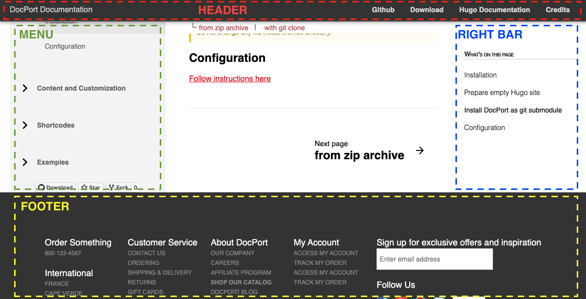
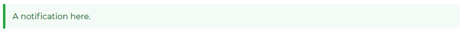
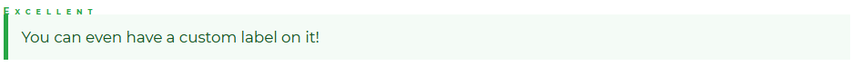

[TOC]

## Install and basics
### Install
I'm on windows and have chocolatey already; by just typing the following line in the command window hugo will be installed.
```
choco install hugo -confirm
```
In the case you need an extended version of hugo:
```
choco install hugo-extended -confirm
```

Hugo will be installed, for example, at [C:\ProgramData\chocolatey\lib\hugo\tools]() and ready for use. For more information, see [this](https://gohugo.io/getting-started/installing/#chocolatey-windows).

You may also download the binary (.exe) file [here](https://github.com/gohugoio/hugo/releases), extract the file to a folder and add that folder to PATH.


After that, open cmd and type `hugo help` to see if hugo is correctly installed.

### Basics
> This section is a brief review of the [quick start section](https://gohugo.io/getting-started/quick-start) of the official documentation, and takes the [techdoc](https://themes.gohugo.io/themes/hugo-theme-techdoc/) themes for example.
#### New site/page (`hugo new`)

Create the skeleton of directory structure in the subfolder of the current directory named "mySite":
```
hugo new site mySite
```

Create a page file
- `hugo new [markdown file]` creates a page of markdown (`.md`) file under the folder `content`:
  - `hugo new index.md`: Create home page; i.e., `content/index.md`.
  - `hugo new posts/my-first-post.md`: Create a post under the subfolder `posts` of the folder `content`; i.e., `content/posts/my-first-post.md`.
#### Add a theme
Find a theme you like [here](https://themes.gohugo.io/), copy the address of github repository and add the theme:
- `cd mySite`: switch current directory to your project folder
- `git init`: initiate a git repository there
- `git submodule add https://github.com/thingsym/hugo-theme-techdoc.git themes/techdoc`: clone the theme you choose to the subfolder `themes/techdoc`.
- `echo theme = \"techdoc\" >> config.toml`: add `theme = "techdoc"` to a new line of `config.toml`. 
- for more information, see [here](https://gohugo.io/getting-started/quick-start/#step-3-add-a-theme).

#### Preview you site locally (`hugo server`)
Live server
- `hugo server -D`: serve contents even if `draft` is set to be `false`.
- `hugo server`: serve contents where `draft` is set to be `true` (default is `false`). We can find the `draft` option in the _**front matter**_ of every `.md` file created with `hugo new`, for example:
  ```
  --- 
  title: "My First Post"
  date: 2021-07-24T11:10:45+08:00
  draft: true
  ---
  ```
  
> **💡 Hint:**
> - By default, your site will be available at http://localhost:1313/.
> - `cd` to `\mySite\themes\techdoc\exampleSite\` and `hugo server` to see how an example site looks like
> - copy the content in `\mySite\themes\techdoc\exampleSite\config.toml` to `\mySite\config.toml`, and do some modification

#### Menu
Generally menu will automatically generated as you create a subfolder with `hugo new`.
For example, `hugo new Hello/index.md`, `hugo new Hello/sunny-day.md`, `hugo new Hello/rainy-day.md`, and set `draft` to be true in the front matter and you will see the following as a collapsible sidebar menu appear on the side of the live server:
```
content/
└── Hello
    ├─Sunny day        
    └─Rainy day 
```

But wait, why didn't the "Post" we created before using `hugo new posts/my-first-post.md` appear? Go to `config.toml` and find the `menu_exclusion` line, it shows
```
    menu_exclusion = [
        "archives",
        "archive",
        "blog",
        "entry",
        "post",
        "posts",
    ]
```
That's it, the folder under the `content` named "post" or "Posts" will be excluded!

##### Weight
You may add, for example,  `weight: 20` (or any positive integer) in the front matter. The lightest will be placed at top, while the heaviest is at the bottom.

#### Layout
You may do some modifications of the files in `\mySite\themes\techdoc\layout`; however, when you uploaded to github all modifications will be restored to default. What you have to do is to copy the files from `\mySite\themes\techdoc\layout` to `\mySite\layout`, where the templates in the latter directory will overwrite the default. For more information, see [this](https://youtu.be/c7vpcqA6SEQ?t=1379).

#### Archetypes
The template of how it creates a new post.
https://youtu.be/c7vpcqA6SEQ?t=1487

### Furthermore

#### Math support

Unfortunately, in most hugo themes (includes docPort) LaTeX math with `$...$` is not supported. 

However, by adding the following two pieces of code:
```
<script type="text/javascript"
  src="https://cdn.mathjax.org/mathjax/latest/MathJax.js?config=TeX-AMS-MML_HTMLorMML">
</script>
```
> (add the MathJax library)

and
```
<script type="text/x-mathjax-config">
  MathJax.Hub.Config({
    tex2jax: {
      inlineMath: [['$','$']],
      displayMath: [['$$','$$']],
      processEscapes: true,
      processEnvironments: true,
      skipTags: ['script', 'noscript', 'style', 'textarea', 'pre'],
      TeX: { equationNumbers: { autoNumber: "AMS" },
           extensions: ["AMSmath.js", "AMSsymbols.js"] }
    }
  });
</script>
```
> (this allows inline-math)

the math expression in the `$$...$$` block will be correctly displayed.

To ensure these pieces of code are included everywhere, you may add them to, for example, in `\themes\docsy\layouts\partials\footer.html`.

For more information, see [here](https://bwaycer.github.io/hugo_tutorial.hugo/tutorials/mathjax/).

## Example
### Another example: docPort
Ref: [the docPort theme](https://themes.gohugo.io/themes/hugo-theme-docport/)




#### A complete go-through
Similarly, 
- `hugo new site mySite`
- `cd mySite`
- `git init`
- `git submodule add https://github.com/vjeantet/hugo-theme-docport.git themes/hugo-theme-docport`
- `echo theme = \"hugo-theme-docport\" >> config.toml`

Preview your site:
- `hugo server`

Open another terminal, and preview the example site:
- `cd themes/hugo-theme-docport/exampleSite/`
- `hugo server`

Copy the contents in `config.toml` from `exampleSite` and do some modification
> - ⚠️ You have to comment out the `themesdir = "../.."` line! This line is for assigning the theme folder manually, because for `exampleSite` the theme folder is two level above.
> - 💡 You'd like to try `hugo server --disableFastRender` if you find some changes didn't render in time.


#### Directory structure
Hugo (with theme docPort) automatically creates menu (left bar) according to the directory structure and supports unlimited levels of menu. 
Therefore, the standard practice is having one markdown file named `_index.md` in one subfolder, and with the images to be included in at the same level of `_index.md`.
It might work if you don't follow the standard structure but you might easily mess things up.

For example, 
`hugo new LaTeX-and-Markdown/Markdown/_index.md` and `hugo new LaTeX-and-Markdown/LaTeX/_index.md` to create notes about Markdown and LaTeX separately, and put the picture to be included by using `` in `/Markdown/_index.md`:

```
content/
└── LaTeX-and-Markdown
    ├── Markdown
    │   ├── _index.md
    │   └── screenshot.png
    └── LaTeX
        └── _index.md
```
#### Front matter options
##### Disable some features
Disable features:
```
hide:
  - header             # the top bar
  - footer             # the bottom bar
  - nextpage           # the next-page button
  - toc                # table of content (right bar)
  - nav                # menu on the left
  - breadcrumb         # 
```

#### Add a footer 
The simplest way to add a footer is to copy all files in `\themes\docport\exampleSite\content\_layout\footer` to `\content\_layout\footer`, and modify the `\content\_layout\footer\_index.md`.
#### Shortcodes
##### Notification
There are three kinds of notification, `success`, `warning`, `danger`, `info`, `light`, `dark`..., and more! For example:
```
{}
A notification here.
{}
```
it creates 


```
{}
You can even have a custom label on it!
{}
```




For more information, see [here](https://docport.netlify.app/shortcodes/notice/#colors)


##### Children
`%children` is very helpful in the summary page of a section. 
You can automatically add a list of hyperlinks for the sub-pages by using
```
{}
```


### Yet another example: docsy
Ref: [the docsy theme](https://www.docsy.dev/docs/getting-started/)

[Option 1: The canonical way](https://www.docsy.dev/docs/getting-started/#option-2-use-the-docsy-theme-in-your-own-site):
- `hugo new site myproject`
- `cd myproject`
- `git init`
- `git submodule add https://github.com/google/docsy.git themes/docsy`
- `echo 'theme = "docsy"' >> config.toml`
- `git submodule update --init --recursive`

- Install PostCSS in your site folder (have npm being installed firstly on Windows)
  - `npm install -D autoprefixer`
  - `npm install -D postcss-cli`
  - `npm install -D postcss`

[Option 2: Clone the docsy example site directly](https://www.docsy.dev/docs/getting-started/#option-1-copy-the-docsy-example-site)
- go to any directory you like and `git clone https://github.com/google/docsy-example.git`
- `cd docsy-example`
- `git submodule update --init --recursive`: This is for running the site locally. This may take several minutes.
- and `hugo server`

> **Notice:**
> - If you start with option 2 (clone the `docsy-example`), the `hugo new posts/_index.md` now creates the file under `/content/en/posts/_index.md` (`en` is for English), since this example provides several language version of websites. **See** the `contentDir = "content/en"` in the `config.toml`.
> - **I strongly recommend optional 2, it is much easier.**


#### `config.toml`

Open the `config.toml` of the `docsy-example`, and
- change the top-left home page button
  - `title = "Learning Notes"` (also change the title under `[languages][languages.en]` if there are multiple languages)
- the bottom left and bottom right buttons 
  - go to `[params.links]` and set; where `[[params.links.user]]` is for buttons on the left and `[[params.links.developer]]` for those on the right.
- change the background image of in the **Entrance** and **About**
  - simply replace the `featured-background.jpg` in `\content\en` and `\content\en\about` by a picture you like 
  > No need to compress the picture! The assets will be automatically generated in `\resources\_gen\images` and `\resources\_gen\images\about`

#### Menu and Directory structure
https://www.docsy.dev/docs/adding-content/navigation/

Menu in the header:
- add `menu: "main"` in the front matter of the `.md` file and the button appear in the header; it is equivalent to add:
  ```
  menu:
    main:
      weight: 22
  ```

    
Unlike techdoc, the directory structure can be simplified as:
```
content/en
└── LaTeX-and-Markdown
    ├── _index.md
    ├── markdown.md  
    └── latex.md
```

##### `title` and `linkTitle`
Specified in the front matter, 
- `title` specify the very first level-1 heading
- `linkTitle` specify the string to show on the menu 

#### Layout
Docsy provides three page template, **blog**, **docs** and **community**. They are placed in `themes/docsy/layouts/`. 

It is easy to apply a template, just **copy the entire folder and rename it**. For example, when you create a tree of pages in `content/en/whatever/`, and you want to apply the "Documentation" template, just copy `/themes/docsy/layouts/docs` to `whatever` to `/layouts/docs` and rename it as `/layouts/whatever`.

Alternatively, you can also specify the layout in the front matter, for example, for the pages under `content/en/whatever`, by adding
```
cascade:
- type: "docs"
```
in the front matter of `content/en/whatever/_index.md`. This is equivalent to have `layouts/docs` copied and renamed as `layouts/whatever`.
For more advanced control, see [alternative-site-structure](https://www.docsy.dev/docs/adding-content/content/#alternative-site-structure).

> **⛏️Trouble shooting**: When you adapt the alternative site structurization, and the site is rendered properly on local but broken on the deployed netlify website, check the hugo-building version. The alternative site structure is supported only for hugo version $\geq$ 0.77 ([see this](https://github.com/gwatts/mostlydocs/)).


> ☠️ Don't modify anything under `themes/docsy`
> - If you want to change anything, copy it (with exactly the same directory structure) to the root `docsy-example` (or your folder renamed from it).
> - For example, copy `/themes/docsy/layouts` to `/layouts` and then have some modifications on files in `/layouts`.


##### disable feedback
Go to `/layouts/docs/list.html` and delete the following lines:
```
{{ if (and (not .Params.hide_feedback) (.Site.Params.ui.feedback.enable) (.Site.GoogleAnalytics)) }}
{{ partial "feedback.html" .Site.Params.ui.feedback }}
<br />
{{ end }}
```

##### Modify Footer or Anything else of the Template
If you want to modify the text and hyperlinks shown in the footer, you might think to go to `layouts/partials/footer.html`. Disappointedly, you see only variable names (e.g. `.Site.Params.privacy_policy`) there. 
To change the text/hyperlinks, you have to find where the variable locates.
As an example, you can follow the following instruction:
- 🔎**Search** "privacy_policy", and you will find `[param][privacy_policy] = "https://..."` in `themes/docsy/config.toml` and `[footer_privacy_policy]other = "Privacy Policy"` in `themes/docsy/i18n/en.toml`
- 🗒️**Copy or modify** the `[privacy_policy]` line in `/config.toml`, create the folder `i18n` and copy `themes/docsy/i18n/en.toml` there and modify the `[footer_privacy_policy]` section.


#### The home page
The home page locates at `/content/en/_index.html`, it takes `/layouts/_default`.
> 💡 The "About" section takes also `/layouts/_default`; however, you may apply a template by copying and renaming page template folder to `about`.

#### Deploy
Link to Github repository
- Create a new Github repository. see [this](../franklin/#publish-the-repository-and-deploy-your-site).
- `cd docsy-example`, and `git remote set-url origin https://github.com/youraccount/YourRepoJustCreated.git`
- `git remote -v`
- `git push -u origin master`

> - `docsy-example` is the folder name of your site on local machine where `.git` exist; you can arbitrarily rename it.
> - For more information, see [this](https://www.docsy.dev/docs/getting-started/#option-1-copy-the-docsy-example-site).


##### Host on Netlify
- [Create an account](https://gohugo.io/hosting-and-deployment/hosting-on-netlify/).
- [Create a new site](https://gohugo.io/hosting-and-deployment/hosting-on-netlify/)
  > 💡 You'll have to press the Github button twice!
  
Choose one:
- (option 1) Add netlify.toml with content:
  ```
  # Hugo build configuration for Netlify 
  # (https://gohugo.io/hosting-and-deployment/hosting-on-netlify/#configure-hugo-version-in-netlify)

  # Default build settings
  [build]
    publish = "public"
    command = "cd themes/docsy && git submodule update -f --init && cd ../.. && hugo"

  # "production" environment specific build settings
  [build.environment]
    HUGO_VERSION = "0.77.0"
    HUGO_THEME = "docsy"
    HUGO_ENV = "production"
  ```

- (Option 2, **not work**) [Advanced setting and deploy](https://www.docsy.dev/docs/deployment/#deployment-with-netlify)
  > 💡 Remember to add **New Variable** and modify **Build Command**!
