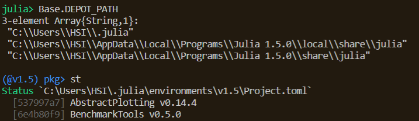
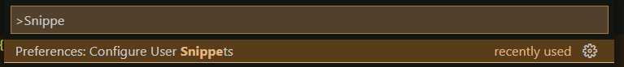
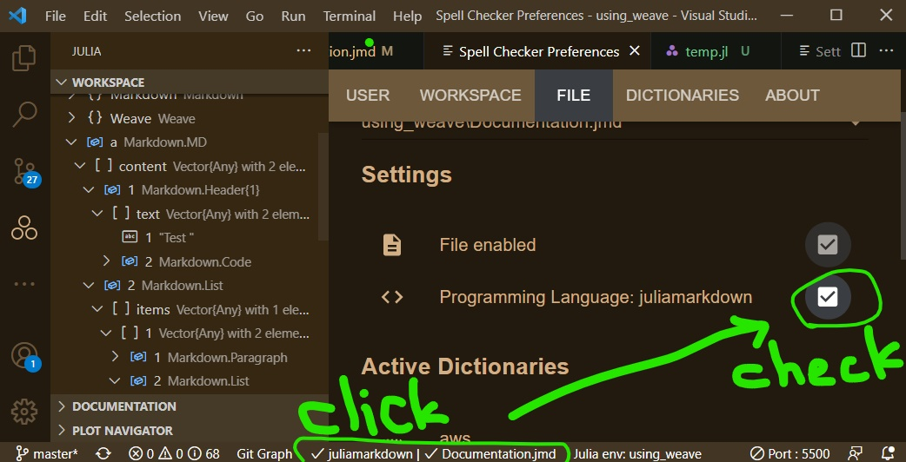

[TOC]
## Basic
### Basic Operation
Start/kill REPL
- `Ctrl+Shift+P`, and type `julia start REPL` to start julia REPL
- or `Alt+J` then quickly press `Alt+O` to start julia REPL. 
- `Alt+J` then `Alt+K` to kill the REPL.


In vscode UI
- click the `julia` button at the bottom of vscode UI, and select the current environment. And the button display something like `julia env: xxxx`
- `Alt+Enter` execute the current line
- click the julia mark () on the left bar to see variable workspace.

### Environment variable in Windows
`JULIA_DEPOT_PATH` are directories for all installed packages. If you want to install julia other than `C:/`, you have to add `JULIA_DEPOT_PATH` to windows' environment variable, with its value being `D:\\GoogleDrive\\1Programming\\julia\\julia-1.5.3_custom_depot\\.julia; D:\\GoogleDrive\\1Programming\\julia\\julia-1.5.3_custom_depot\\local\\share\\julia;
D:\\GoogleDrive\\1Programming\\julia\\julia-1.5.3_custom_depot\\share\\julia` as an example.

How to see the paths of the working julia?
- 
### Basic Debugging
```julia
function foo(data,origin)
# <- set debug point in vscode at the place you like.
end
```

- `julia> @run foo(cars, origin)`

## More
### Microsoft vscode code space
- virtual machine: https://youtu.be/IdhnP00Y1Ks?t=841
- Live Share, link your vscode to the virtual machine that every one can see what you did while you in fact working on your local vscode interface. https://youtu.be/IdhnP00Y1Ks?t=1046

### Snippet
- `Ctrl+Shift+P` 
- 
- choose your language (julia)
- write your snippet
  ```
  {
  	"Activate Task specific project environment": {
  		"prefix": "acti-task",
  		"body": [
  		  "rootdir = joinpath(@__DIR__, \"..\");",
  		  "srcdir = joinpath(rootdir, \"src\");",
  		  "datadir = joinpath(rootdir, \"data\");",
  		  "",
  		  "using Pkg",
  		  "Pkg.activate(rootdir);",
  		  "",
  		  "for jl_file in readdir(srcdir)",
  		  "    include(joinpath(srcdir, jl_file));",
  		  "end"
  		],
  		"description": "Activate Task specific project environment"
  	}
  }
  ```
  that you can just type "acti-task" to auto complete the codes (snippet) when the language is selected (detected) to be julia. 
  > **If not appear**, try `Ctrl`+`Space` and type the prefix you define.
  > **Note that** escape character (`\"`) for a double quote in a pair double quote is required. That is, in julia we have `rootdir = joinpath(@__DIR__, "..")`, and in the setting.json for julia in vscode, it has to be `"rootdir = joinpath(@__DIR__, \"..\")"`
- also see [vscode code snippet generator](https://snippet-generator.app/)

 
 
 ### Code/English spell check
If you want to enable code check (or English spell check), install the add-on [streetsidesoftware.code-spell-checker]() and click the button showing the language below and check the box!

